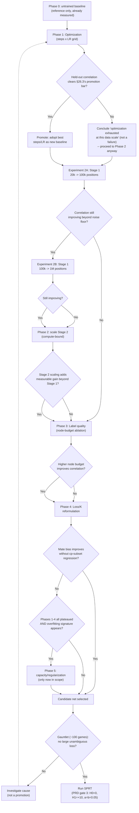

# NNUE Improvement Analysis: Data, Labels, and a Sequenced Experiment Plan

Phase E (NNUE), net `dfffd3da-7f8f-4fc9-92dc-b3873c97fb21`. This document supersedes the
prioritization in the initial architecture review (chat-only, 2026-07-19 AM) after that
review's own conclusions were critiqued and re-graded against repository evidence. It
distinguishes **established facts** (directly measured or directly read from code) from
**hypotheses** (graded by evidence strength) from **open questions** (no evidence either
way), and lays out a sequenced, falsifiable experiment plan rather than a single
prioritized-by-guess roadmap.

Related: `docs/NNUE_PRD.md`, `docs/architecture/research/DR-E1-self-play-data-generation.md`,
`docs/architecture/research/DR-D8-stockfish-labeling-driver.md`,
`docs/architecture/research/2026-07-16-mining-played-games-for-training-data.md`,
`tools/nnue-gauntlet-e4.md`, `nets/HISTORY.md`, GitHub issue #206 (E-6, Performance Gate).

---

## 1. Established facts (directly measured or read from code)

- Net `dfffd3da-...`: 36,000 training positions (20k Lichess Stage 1 + 20k Stockfish-relabeled
  Stage 2, 90/10 train/held-out split), 2000 steps @ batch_size=256 (~14.2 epochs over the
  corpus), Adam, fixed LR=0.01, no LR schedule, no per-epoch reshuffle, no early stopping, no
  L2/dropout (only an overflow-safety weight clamp for quantization). Held-out loss 0.0823,
  label correlation 0.504 (n=4000), mean abs eval error vs. classical 735.6cp (n=393).
  Full run completes in ~20 seconds (`trainer/configs/train-e3-real.md:126`).
- Architecture: plain 768 dual-perspective features (no HalfKP/king-buckets — `ADR-001`),
  `(768→256)×2→1`, single hidden layer, clipped-ReLU, `qa=127`/`qb=64`/`outputScale=400`.
- Targets: pure `eval_cp` regression via `texel_sigmoid(cp, K=2.773456)`, K freshly calibrated
  against the live classical `EvalParams`. No WDL/λ-blend is implemented — `train.py`'s own
  module docstring states only the eval_cp half of the PRD's designed blend exists; every
  reachable `DatasetProvider` has no WDL field populated.
- Stage 2 Stockfish labeling: `nodes=25000`, `threads=1`, **MultiPV not pinned** (Stockfish's
  UCI default of 1 governs, undocumented as a deliberate choice —
  `trainer/configs/stockfish-label-e2-real.md`), **no re-search or PV-stability check** — one
  fixed-node search per position, no confidence/variance metric. `DR-D8` names this gap
  explicitly as deferred, not overlooked.
- Mate scores are stored raw (`eval_mate`, ply count) and converted only at training time to a
  flat `MATE_EQUIVALENT_CP = 3000.0` regardless of mate distance (mate-in-1 == mate-in-20).
- Stage 1 (Lichess) has **zero quiet/tactical filtering** (`acquire_stage1_lichess.py`
  `_to_record()` only checks eval/PV presence). Stage 2 sources from `data/quiet-labeled.epd`
  (Zurichess quiet-filter, every 36th line) but **never re-verifies quietness after
  re-labeling** at a different node budget than the original corpus was built with.
- **Deduplication and phase-balancing code exists, is exported, and is never called.**
  `trainer/trainer/dataset/transform.py` implements `deduplicate()`, `phase_of()`,
  `balance_phases()`, `filter_by_ply_range()` — none are invoked by
  `train_candidate_net.py`'s `combine_and_split()`, the function that actually produced the
  36k-position training set. No duplicate-rate, phase-distribution, material-imbalance, or
  side-to-move-balance number has ever been computed for this corpus.
- `data/quiet-labeled.epd` (Stage 2's own position source, 725,000 lines) carries a `c9`
  game-result field on every line. Stage 2 explicitly discards it
  (`stockfish-label-e2-real.md:55-56`) in favor of a fresh Stockfish eval. `PositionLabel.wdl`
  already exists as a contract field (`trainer/trainer/contracts/dataset.py:96-98`),
  unpopulated by any current provider; `SHARD_DTYPE` has no wdl column yet
  (`mmap_shard.py:59-67`, explicit "out of scope until that stage lands" docstring).
- `train()` computes a full per-step training-loss list and it is thrown away — only the final
  value is printed (`train_candidate_net.py:124`). Held-out loss is computed **exactly once**,
  post-hoc, after all 2000 steps (`validator.py:73-91`) — there is no intermediate validation
  loss at any point during training.
- `engine-tuner`'s classical Texel-tuning pipeline already has convergence-based early stopping
  (`GradientDescent.java:40-42`, relative-delta threshold `5e-4` sustained over a patience
  window) and an explicit, numerically-thresholded train/val overfitting check
  (`TunerMain.java:347-354`, `msGap > 0.002` triggers a warning). None of this pattern is
  reused by the NNUE trainer.
- A fixed-depth NPS/eval-throughput benchmark harness already exists and is fully built:
  `engine-core/src/test/java/.../nnue/NnueCorpusBenchmarkTest.java` (`evalThroughput()`,
  `fixedDepthNps()`). It has never been run against the real candidate net — only against a
  tiny synthetic fixture — and is not wired into CI.
- The PRD's own performance gate (NNUE search ≥40% of classical NPS) has **never been measured
  or recorded anywhere in this repo, on any platform.** Confirmed via `gh issue view 206`
  (OPEN) and the release report's own "deferred to E-6, not measured or gated here" statement.
- Fast gauntlet (TC=10+0.1, unbounded depth within the clock): NNUE loses decisively across two
  independent runs (0-95-5, Elo diff -636.4±224.0; and 1-87-12, -449.4±107.9 — overlapping
  confidence intervals, same underlying result, not a new regression).
- Slow SPRT (TC=60+0.6, H0=0/H1=+10, α=β=0.05, bounds ±2.94): two checkpoints, both trending
  toward H0 — 1039 games (0.496 score, LLR -1.25) and 2617 games (0.502 score, LLR -1.32),
  manually stopped by the operator before resolution, not exhausted by design.

## 2. The central unexplained anomaly

**The fast gauntlet shows the net losing by ~450–640 Elo. The slow SPRT shows it at
approximately parity (LLR trending to exactly 0).** Both measure the same net. This gap is the
single most important open question in the pipeline and was under-weighted in the first-pass
review (filed as a footnote rather than the headline finding it is). Two explanations are
plausible and not yet distinguished:

1. NNUE-mode search has a real per-node cost penalty (unmeasured — see §1) that starves search
   depth at TC=10+0.1 far more than at TC=60+0.6, and the fast gauntlet is measuring depth
   starvation more than eval quality.
2. The net's eval quality really is that much weaker, and the SPRT's near-0 result is itself
   the artifact — the SPRT's tight ±10 Elo bound, run at high concurrency, might be dominated
   by search-quality convergence (both engines eventually find similar moves at 60+0.6 given
   enough search depth) even when the raw evaluator is much worse in isolation.

Experiments 1–2 below are designed specifically to resolve which of these is true, or how much
of each is in play.

### 2.1 Ranked hypotheses (2026-07-19 follow-up — no root cause asserted)

The two explanations above are a starting split, not an exhaustive account. A closer read of
`Searcher.java`'s pruning/aspiration code surfaces a wider hypothesis space. Ranked by
plausibility; no hypothesis below is asserted as *the* cause — each lists the minimum single
experiment that would distinguish it from the others.

1. **(Highest) Evaluation-scale/volatility mismatch interacting with hardcoded cp-margin
   heuristics.** Every relevant pruning/aspiration constant is a literal, evaluator-agnostic
   number tuned exclusively against the classical evaluator: `ASPIRATION_INITIAL_DELTA_CP = 25`
   (`Searcher.java:34`), `NULL_MOVE_DEPTH_THRESHOLD = 4` — whose own in-code comment states it
   was tuned via SPRT *against the classical evaluator specifically* ("C-5 SPRT: threshold=4
   won (+90.3 Elo vs baseline, H1 accepted)", `Searcher.java:35`), `FUTILITY_MARGIN_DEPTH_1/2 =
   150/300` (`:37-38`), `RAZOR_MARGIN_DEPTH_1/2 = 300/600` (`:39-40`), and a ±32cp correction-
   history cap (`CORRECTION_HISTORY_MAX = 256*32`, `:63-64`, applied at `:852`). None of
   `canApplyNullMove`/`canApplyRazoring`/`canApplyFutilityPruning` branch on which
   `EvaluatorStrategy` is active — they consume `staticEval` identically regardless of source.
   Given NNUE's 735.6cp mean abs error is enormous relative to a 25cp aspiration window or even
   a 600cp razor margin, these fixed thresholds could misfire (extra re-searches, wrong prune
   decisions) in a way that costs disproportionately more at a tight, re-search-intolerant fast
   TC than at a slow one — a mechanism distinct from both raw NPS cost and "the eval is just
   worse."
   *Minimum distinguishing experiment*: surface the aspiration-window re-search count (the
   `consecutiveFailures` mechanism at `Searcher.java:622-641` already tracks this internally —
   exposing it as a counter is a one-line change) and compare its rate between NNUE-mode and
   classical-mode runs over the same bench positions at the same depth.
2. **(High) Raw NPS / search-depth starvation.** Entirely unmeasured today (issue #206 open).
   Plausible on priors, no direct evidence either way.
   *Minimum distinguishing experiment*: Experiment 1 (§6) itself.
3. **(High) Real, depth-independent eval-quality gap.** Also plausible on priors — 735.6cp mean
   abs error is large by any standard — but not yet separated from #1/#2 by any experiment.
   *Minimum distinguishing experiment*: Experiment 2 (§6), fixed-depth gauntlet.
4. **(Medium) NNUE accumulator incremental-update cost, uncounted by existing benchmarks.**
   `NnueEvaluator.onMake()`/`onUnmake()` (`NnueEvaluator.java:96-107,150-153`) run two
   `System.arraycopy` calls plus sparse feature updates on every make/unmake in the tree — a
   real, fixed per-node cost that `NnueCorpusBenchmarkTest.evalThroughput()` structurally
   cannot see (it calls `reset()` fresh per FEN and never exercises the incremental path a real
   search runs thousands of times per move). Not competing with #2 — a previously-uncounted
   component of it.
   *Minimum distinguishing experiment*: the accumulator-cost instrumentation in §12 (Search
   Diagnostics), run during a real search rather than the isolated throughput test.
5. **(Lower) Broader search-parameter interaction — LMR.** `LMR_LOG_DIVISOR = 1.7`'s reduction
   formula (`Searcher.java:66-71,1300-1330`) depends only on `depth`/`moveIndex`, with **no
   direct dependency on eval magnitude or cp-scale** — structurally unlike the margin-based
   heuristics in #1. Ranked lower specifically because it lacks that direct cp-scale coupling;
   any interaction (e.g. via move-ordering quality, which does depend on eval quality) would be
   second-order.
   *Minimum distinguishing experiment*: compare `lmrApplications`/`futilitySkips`/
   `nullMoveCutoffs` counts (already tracked and surfaced via the existing `[BENCH]` log line,
   `Searcher.java:96-99`) between NNUE-mode and classical-mode at fixed depth over the same
   positions — zero new code required, just a comparative run that has never been done.
6. **(Lowest) Implementation/wiring bug (e.g. silent classical fallback).** Substantially
   argued against already: `tools/nnue-gauntlet-e4.md`'s own evidence-strength note observes
   that a clean 636-Elo blowout with realistic termination reasons and a normal 48/47
   White/Black split is inconsistent with a silent both-sides-fell-back-to-classical bug
   (which would produce a near-50/50 result instead). Not eliminated, but the cheapest to rule
   out definitively.
   *Minimum distinguishing experiment*: re-run a short gauntlet sample with `cutechess-cli
   -debug` enabled, confirming `info string NNUE network loaded` appears in-band throughout —
   `nnue-gauntlet-e4.md` already names this exact follow-up trigger.

## 3. Hypothesis evidence grading (critique of the first-pass review)

| Conclusion | Grade | Basis |
|---|---|---|
| Data scale (36k positions) is *the* dominant bottleneck, top priority | **Weak hypothesis** (was overstated as near-proven in the first-pass review) | No controlled comparison exists at any other data volume. Grounded in generic NNUE-literature priors, not a repo measurement. Downgraded from "priority #1, near-zero risk" — the "near-zero risk" framing was itself wrong (a 10-100x re-label run costs hours with no diagnostic in place to interpret the result). |
| Architecture depth / HalfKP premature for v1 | **Strong hypothesis** | Grounded in a real, explicit repo fact: `docs/NNUE_PRD.md` "Non-Goals (v1)" and `ADR-001` deliberately exclude both, for stated reasons (data requirement, accumulator-refresh complexity). Sequencing "diagnose before restructuring" survives the critique even though "data is the answer" does not. |
| NPS cost confounds the fast gauntlet | **Weak hypothesis, correctly flagged as unmeasured, but previously mis-stated as "partly attributed"** | No NPS number exists for NNUE mode anywhere. This is a plausible confound with existing-but-unrun infrastructure to test it (§1), not a finding. |
| SPRT bounds "under-powered" at 2617 games | **Retracted — was a mischaracterization** | The SPRT was manually stopped, not exhausted by an under-powered design; LLR was trending toward H0 (evidence of no effect), not stuck ambiguously. The real finding is the gauntlet/SPRT discrepancy (§2), not that the SPRT needed more games. |
| LR schedule / no-reshuffle is second-order | **Weak hypothesis**, correct conclusion for the wrong stated reason | No LR ablation exists. Should be deprioritized because no instrumentation yet exists to tell whether training is even near a minimum (§4), not because LR scheduling is inherently low-value. |
| Pure cp-regression (no WDL) may be leaving signal on the table | **Strong hypothesis, upgraded this pass** | A WDL signal (`c9` on 725k Stage-2-source positions) already exists on disk, unused, for free — this is now a scoped, buildable experiment (Exp. 6), not speculation. |

## 4. Falsifiable diagnostic criteria (architecture- vs. data- vs. label- vs. optimizer-limited)

Requires only: log train loss every N steps (already computed, currently discarded) and
held-out loss every N steps (currently computed once, post-hoc). No architecture or data
change needed to collect this.

1. **Data-limited, not yet plateaued**: train loss still falling >5e-4 relative over the
   trailing 200 steps at step 2000, AND held-out loss tracks train loss within a ~15% relative
   gap → more steps/data plausibly still help.
2. **Overfitting / architecture-or-regularization-limited**: train loss keeps falling while
   held-out loss flattens or rises (the `msGap`-style divergence `engine-tuner` already checks
   for elsewhere in this repo) → more data is the wrong first move; check reshuffle-per-epoch
   and regularization before scaling.
3. **Label-limited**: held-out loss plateaus early and label correlation (0.504 today) stays
   low even as train loss keeps falling → labels carry noise the model can't out-learn.
   Falsifiable directly via Experiment 5's node-budget-variance measurement.
4. **Optimizer-limited**: train loss oscillates/diverges rather than monotonically decreasing
   at fixed LR=0.01 → checkable **today** from the already-computed, currently-discarded loss
   list, zero new instrumentation required.

## 5. Evaluation framework: separating evaluator quality from search quality

- **Fixed-depth / fixed-node NPS and eval-throughput** (`NnueCorpusBenchmarkTest`, already
  built, never run against the real net) isolates eval-function cost from search-depth
  reached under a clock. This is what the PRD's ≥40% gate is actually asking for, and answers
  it directly — no new design work needed, only execution (issue #206 / E-6).
- **Fixed-TC gauntlet/SPRT** (already run twice) is the end-to-end signal: eval quality +
  NPS cost + reachable search depth, conflated by design. Useful as a final promotion gate,
  not as a diagnostic on its own.
- **Regression-metrics checklist every training run should produce** (checked against what
  exists today):

  | Metric | Exists today? |
  |---|---|
  | Train loss vs. step (curve) | Computed, discarded |
  | Held-out loss vs. step (curve) | Absent — post-hoc single value only |
  | Train/val gap with a numeric threshold | Absent (precedent exists in `TunerMain.java`) |
  | Label (Pearson) correlation | Exists, post-hoc |
  | MAE vs. training label itself | Absent (only MAE vs. a separate classical-golden corpus) |
  | RMSE | Absent |
  | Phase-specific accuracy (opening/mid/endgame) | Absent, despite `phase_of()` existing unused |
  | Calibration (reliability curve) | Named as deferred future work in `validator.py`'s own docstring |
  | Fixed-depth NPS/throughput | Built, unrun against real net |

### 5.1 Evaluator calibration diagnostics

MAE and Pearson correlation (table above) say how *loosely* predictions track targets, not
whether they're *systematically* biased. Calibration is a distinct, additional question, and
every metric below is computable directly from arrays `validator.py` already holds in memory
(`predicted`, `target` per held-out record) — no plotting library or external tool needed. The
pipeline's job is to persist the underlying numeric aggregates; rendering a scatter plot or
reliability curve from that output is a separate, later concern for whoever wants a picture.

- **Predicted-vs-target relationship without a scatter plot**: bin held-out records by
  target-cp decile (or fixed-width bucket) and report `mean(predicted) - mean(target)` per
  bucket. This is the numeric content a calibration curve would plot — a groupby/aggregate,
  not a rendering step.
- **Systematic overestimation / underestimation**: signed mean error, `mean(predicted -
  target)`, overall and per bucket — currently absent; `validator.py` only reports MAE, which
  discards sign by construction and cannot distinguish a biased net from a noisy-but-unbiased
  one.
- **Score compression / expansion**: `std(predicted) / std(target)`. Near 1 means the net's
  output spans a comparable cp range to the target; well below 1 is compression (the net is
  "flatter" than reality — plausible for a severely undertrained net regressing toward the
  mean, per §1's 735.6cp error and 0.504 correlation); above 1 is expansion (overconfident).
- **Mate-score handling**: since `target_cp()` already collapses every mate score to a flat
  ±3000cp (§1, established fact), calibration should be reported separately for mate-labeled
  vs. cp-labeled held-out records. Mixing them would hide whether a bias/compression effect is
  specific to the mate-handling constant or a general property of the cp regression.
- **Phase-specific calibration**: bucket by `phase_of()` (already exists, unused per §1) and
  report per-phase signed-mean-error and compression ratio — the same unused function Issue A
  wires in for the dataset side, applied here to held-out predictions instead of raw position
  counts.

None of this requires new infrastructure beyond what `evaluate_held_out`/`_pearson_correlation`
already load into memory — every metric above is an aggregate over data the pipeline already
has.

## 6. Sequenced experiment plan

Ordered for information-gained-per-engineering-cost. Instrumentation and measurement come
before any data-scaling or architecture change. **Tier** distinguishes reusable Infrastructure
(should generally become a GitHub issue once, ahead of the experiments that consume it) from
one-off Experiments (stay documented until their supporting infrastructure exists, run ad hoc
rather than issue-tracked).

| # | Experiment | Tier | Hypothesis | Effort | Runtime | Success criteria | If successful | If unsuccessful |
|---|---|---|---|---|---|---|---|---|
| 1 | Run existing fixed-depth NPS benchmark against real net (= issue #206/E-6, no new issue needed) | Experiment (infra already exists) | NNUE search meets/fails the ≥40% NPS gate; result bounds how much of the fast-gauntlet loss is NPS-attributable | Near-zero (infra exists) | Minutes | Recorded NPS number + pass/fail | Gate passes → -636 Elo is real eval weakness, raise priority of Exp. 5/6 | Gate fails badly → re-run Exp. 2 before trusting any gauntlet result |
| 2 | Re-run E-4 gauntlet at fixed depth instead of fixed TC | Experiment (supporting infra — fixed-depth mode in `nnue-gauntlet.ps1` — doesn't exist yet; build only if Exp. 1 doesn't cleanly resolve the anomaly) | A fixed-depth gauntlet shrinks the Elo gap toward the SPRT's near-0 result if NPS was the confound | Low | ~1hr range | Elo number comparable to -636 and to the SPRT's ~0 | Gap shrinks → NPS/search-depth was the dominant confound, redirect to performance engineering | Gap stays near -636 → eval weakness is real and depth-independent, deprioritize NPS work |
| 3 | Wire existing `deduplicate`/`phase_of`/`balance_phases` into `combine_and_split` as a reporting pass | **Infrastructure — Issue A** | Current 36k set has a hidden duplicate-leak or phase skew | Near-zero (code exists, unused) | Seconds | Duplicate rate, phase distribution report | Non-trivial skew found → re-run training with dedup/balance before any data-scale conclusion | Negligible → rules out this confound cheaply |
| 4 | Persist train-loss curve + add held-out-loss-vs-step logging | **Infrastructure — Issue B** | Loss curve shape distinguishes data/architecture/label/optimizer-limited per §4 | Low | ~same as existing run (~20s + trivial eval overhead) | `(step, train_loss, held_out_loss)` table for the existing run, bit-identical seed | Still-decreasing + tight gap → proceed to Exp. 7 | Diverging gap → investigate reshuffle/regularization before scaling data |
| 5 | Label-noise floor: re-label same 1,000 positions at two node budgets (25k vs 50k) | Experiment (existing `stockfish_label.py` config knob; cheap enough to run ad hoc, not worth issue overhead) | Single fixed-node labels carry non-trivial variance, bounding achievable held-out loss | Low | Minutes | Distribution of \|eval_25k − eval_50k\| in cp | Large spread → reprioritize toward higher node budget / stability check over raw volume | Small spread → strengthens case for Exp. 6/7 as the real levers |
| 6 | Add free WDL signal (`c9`) to Stage 2, train λ-blended variant on the *same* 36k corpus | Infrastructure-shaped, but deferred (depends on Exp. 4/Issue B landing first so the A/B is interpretable) | Blended target improves held-out metrics at fixed data volume | Medium (extend `SHARD_DTYPE`, thread `c9` through, implement blend in `train.py`) | Same as existing (~20s) + one-time format work | Held-out loss/correlation, blended vs. cp-only, controlled A/B | Improves → target formulation was leaving signal on the table, reprioritize above pure scaling | No change → strengthens the case that volume is the real bottleneck |
| 7 | Data-scale ablation as a log-spaced curve (40k → 100k → 400k), not one 10-100x jump | Experiment, gated behind Exp. 3/4 (Issues A/B) so each scale point is diagnosable | Held-out metrics improve monotonically or plateau as a function of corpus size | Medium-high (hours of labeling compute) | Hours, scaling with size | Curve of held-out loss/correlation/eval-error at each scale point, each diagnosable via Exp. 4's logging | Still improving at largest scale → continue scaling | Plateaus early → data volume was not the dominant lever, revisit architecture/HalfKP with a real ADR |
| 8 | Search-time instrumentation: eval latency, accumulator-update cost, PV/cut-node eval frequency | **Infrastructure — Issue C** | Isolates whether NNUE changes search *behavior* (re-search rate, pruning-trigger rates), not just raw eval accuracy — the direct enabler for §2.1 Hypotheses 1, 4, 5 | Low (three single-call-site additions, no architectural change — see §12) | Same as existing bench suite | Eval-time %, accumulator-update-time %, PV/cut-node counts, comparable NNUE vs. classical | Localizes which §2.1 hypothesis the anomaly is consistent with | Rules hypotheses out, narrowing the remaining search space |

## 7. Roadmap — Infrastructure / Experimental / Evaluator-improvement tiers

Infrastructure generally precedes the experiments that depend on it; experiments generally
precede any change to the evaluator itself. Not sorted by expected Elo alone — front-loads
uncertainty reduction. Dependency changes from the 2026-07-19 follow-up review are called out
explicitly where they differ from the original sequencing.

**Tier 1 — Infrastructure (build once, reusable, no evaluator change)**

| Improvement | Expected Elo gain | Effort | Risk | Prerequisites | Information gained |
|---|---|---|---|---|---|
| Wire dedup/phase-balance reporting (Exp. 3 / Issue A) | None directly | Near-zero | None | None | Confirms/refutes a hidden data-quality confound, permanently, for every future run |
| Persist loss curves (Exp. 4 / Issue B) | None directly | Low | None | None | Prerequisite for correctly interpreting Exp. 6/7; reuses `engine-tuner`'s own convergence-logging precedent |
| Search-time instrumentation (Exp. 8 / Issue C) | None directly | Low | None | None | Prerequisite for distinguishing §2.1's Hypotheses 1/4/5 from each other — without it, any future search-behavior question re-derives from scratch |

**Tier 2 — Experimental (one-off validation runs, use Tier 1's output to interpret)**

| Improvement | Expected Elo gain | Effort | Risk | Prerequisites | Information gained |
|---|---|---|---|---|---|
| Run existing NPS benchmark against real net (Exp. 1 / #206) | None directly | Near-zero | None | Real `.nnue` file (exists) | Resolves the single highest-value unknown: is the fast-gauntlet loss an NPS artifact or real |
| Fixed-depth gauntlet re-run (Exp. 2) | None directly | Low | Low | Exp. 1 (build only if Exp. 1 doesn't resolve the anomaly — **dependency added this pass**, was previously unconditional) | Isolates eval quality from search-depth confound |
| Label-noise floor (Exp. 5) | None directly | Low | None | None | Establishes a hard floor on achievable held-out loss |
| Data-scale ablation (Exp. 7) | Unknown — previously asserted as "large" without support | Medium-high | Low (compute cost only) | **Now explicitly gated on Issues A/B landing first** (was "Exp. 1–6 ideally first") | The actual data needed before "scale 10-100x" is anything but a guess |
| Re-verify quietness of relabeled `quiet-labeled.epd` positions | Unknown | Medium | Low | **Gated on Exp. 5's result** (large node-budget variance justifies this; small variance doesn't — dependency added this pass) | Bounds label noise from a second angle beyond Exp. 5 |

**Tier 3 — Evaluator improvements (change the net/target itself; wait for Tier 1+2 signal)**

| Improvement | Expected Elo gain | Effort | Risk | Prerequisites | Information gained |
|---|---|---|---|---|---|
| WDL-blend from `c9` (Exp. 6) | Unknown, plausible (Stockfish/nnue-pytorch precedent) | Medium | Low-medium (touches training-target contract; re-run mirror-symmetry/regression suite per CLAUDE.md) | Exp. 4 / Issue B | Answers "is target formulation the bottleneck," independent of volume |
| HalfKP / king-buckets | Plausibly large per literature; excluded from v1 by design (ADR-001) | High | Medium-high (new feature extractor, new ADR) | Tier 1+2 largely exhausted | Only informative once cheaper levers are ruled out |
| Deeper/wider architecture | Unknown | Medium-high | Medium | Exp. 4 showing an architecture-limited signature | Same — premature before diagnostics point at architecture |

## 8. Task triage and issue determination (2026-07-19 follow-up review)

Re-triage of every proposed task (the original five §8 candidates plus the broader §7 roadmap
items) against four categories — **Infrastructure** (reusable capability, generally an issue
now), **Experiment** (one-off validation run, stays documented until its supporting
infrastructure exists), **Investigation** (reading/analysis, no new capability), **Documentation**
(deliberately deferred roadmap entry):

| Task | Category | Create issue now? | Reasoning |
|---|---|---|---|
| Run NPS gate against real net | Experiment (infra exists) | **No** | Already fully covered by existing issue **#206** — see §8.1 below, no duplicate needed |
| Fixed-depth gauntlet re-run | Experiment (supporting infra doesn't exist yet) | **No — stays documented** | Building the fixed-depth mode before #206's result lands risks a wasted issue if #206 alone resolves the anomaly |
| Wire dedup/phase-balance reporting into `combine_and_split` | **Infrastructure** | **Yes — Issue A** | Zero prerequisites, near-zero effort, permanent capability for every future training run |
| Persist train-loss curve + held-out logging | **Infrastructure** | **Yes — Issue B** | Same reasoning; reuses `engine-tuner`'s own convergence-logging precedent |
| Label-noise floor (relabel at two node budgets) | Experiment (existing config knob) | **No** | Cheap, ad hoc, minutes-long; issue-tracking overhead is disproportionate to its scope |
| WDL-blend from `c9` | Infrastructure-shaped, but deferred | **No, not yet** | Depends on Issue B landing first so the A/B result is interpretable |
| Data-scale ablation | Experiment | **No** | Explicitly gated behind Issues A/B — uninterpretable before that diagnostic infrastructure exists |
| Quietness re-verification (PV-stability check) | Infrastructure-shaped, unproven value | **No** | `DR-D8` already named this optional future work; gate its justification on the label-noise-floor experiment's result rather than building speculatively |
| HalfKP / king-buckets | Documentation | **No** | Explicit PRD/ADR-001 non-goal for v1; nothing in this pass changes that |
| Deeper/wider architecture | Documentation | **No** | Premature before any diagnostic shows an architecture-limited signature |
| Search-time instrumentation (eval latency, accumulator cost, PV/cut-node frequency) | **Infrastructure** *(newly surfaced this pass — see §12)* | **Yes — Issue C** | Prerequisite for distinguishing §2.1's ranked hypotheses; zero prerequisites, single-call-site additions |

Net effect: **3 issues recommended** (down from the original 5 candidates), all Infrastructure-
tier; everything else stays documented pending a named prerequisite.

### 8.1 Issue #206 scope determination

`gh issue view 206`'s actual acceptance criteria: run `--bench` in NNUE mode on native Windows,
record NPS against the 316,964 baseline (301,116 floor), make a pass/fail call, and — only if
the gate fails — profile and open a Vector-API follow-up. This is **exactly** Experiment 1's
scope, word for word; `--bench` is the same fixed-workload measurement
`NnueCorpusBenchmarkTest` performs at finer grain. **No new issue needed, and #206's text does
not need editing** — it already fully covers Experiment 1 as written.

Experiment 2 (fixed-depth *gauntlet*, an Elo/game-outcome diagnostic aimed at the §2 anomaly,
requiring `cutechess-cli` and a full match) is a different measurement in kind, not degree —
folding it into #206 would conflate a raw-throughput pass/fail gate with a game-outcome
diagnostic. It should become its own issue only if #206's result doesn't cleanly resolve the
anomaly on its own; for now it stays documented (§6/§7) rather than filed.

### 8.2 Recommended new issues (3, not 5)

**Issue A — Wire `deduplicate`/`phase_of`/`balance_phases` into `combine_and_split` as a
reporting pass**
- *Objective*: surface duplicate-FEN rate and opening/middlegame/endgame distribution for the
  real 36k-position training corpus, using the already-built, already-exported
  `trainer/trainer/dataset/transform.py` functions that `train_candidate_net.py` never calls.
- *Long-term direction (two-stage, this issue is Stage 1 only)*:
  - **Stage 1 (this issue)**: reporting only. No change to what data actually trains the net,
    no change to the split logic. Purely surfaces numbers that don't exist today.
  - **Stage 2 (future, separate issue, not scoped here)**: optional enforcement — actually
    deduplicating and/or phase-balancing the corpus before training — gated on Stage 1's
    report showing a non-trivial skew or duplicate rate. Do not build Stage 2 speculatively;
    a clean Stage 1 report (negligible duplicates, reasonable phase spread) means Stage 2 may
    never be justified at all.
- *Acceptance criteria*: `combine_and_split` (or a thin wrapper) reports duplicate count/rate
  and phase-bucket counts for the actual Stage1+Stage2 union before the 90/10 split; report
  committed alongside the next training run record (matching the `train-e3-real.md` convention).
- *Dependencies*: none.
- *Estimated effort*: XS.
- *Expected long-term value*: every future training run gets this report for free; directly
  answers whether current held-out metrics are compromised by a duplicate leak or phase skew,
  and whether Stage 2 enforcement is ever actually warranted.

**Issue B — Persist train-loss curve + intermediate held-out-loss logging**
- *Objective*: stop discarding `train()`'s per-step loss list; call `evaluate_held_out` every N
  steps instead of once, post-hoc, at the end.
- *Additional training diagnostics considered for this issue*:
  - **Learning rate — include.** Currently fixed (LR=0.01, no schedule, §1), so logging it per
    step is a constant today — but it's a zero-cost single scalar to persist alongside loss,
    and becomes valuable the moment a schedule is ever introduced (forward-compatible; avoids
    re-opening this issue later for one field).
  - **Gradient norm — include.** Directly strengthens §4's Criterion 4 (optimizer-limited:
    "train loss oscillates/diverges") — a gradient-norm blowup or collapse is a more direct,
    standard optimizer-pathology signal than loss-curve shape alone, and is a single
    total-norm-over-parameters computation per step in the existing PyTorch loop. Cheap,
    directly useful.
  - **Weight norm — exclude from this issue's scope.** No §4 falsifiable criterion depends on
    weight norm specifically, and quantization's existing overflow-safety clamp
    (`clip_ft_weights_()`, §1) already bounds weight magnitude for a different reason (numeric
    safety, not training diagnosis). Would not distinguish any of §4's four bottleneck
    categories. Add later only if a specific future hypothesis needs it.
  - **Activation statistics — exclude from this issue's scope.** A materially similar tool
    already exists on the inference side: `NnueEvaluator.explainEval()`'s
    `rangeAndClipCount()` reports per-perspective pre-activation min/max/clip-count today.
    Building a parallel training-side version here would duplicate that idea rather than reuse
    it. If training-time activation statistics become genuinely necessary, scope that as its
    own follow-up rather than folding it into this issue's already-defined loss/held-out-loss
    scope.
- *Acceptance criteria*: a `(step, train_loss, held_out_loss, learning_rate, gradient_norm)`
  series persisted for a full training run (re-running the bit-identical E-3 config validates
  it); §4's falsifiable criteria become checkable from this output without further code changes.
- *Dependencies*: none.
- *Estimated effort*: S.
- *Expected long-term value*: converts every future training run from "one final number" into
  a diagnosable curve — the single highest-leverage instrumentation gap identified across both
  review passes, directly reusing `engine-tuner`'s own convergence-logging pattern.

**Issue C — Add search-time instrumentation for evaluator latency, accumulator-update cost,
and PV/cut-node eval frequency**
- *Objective*: add the three cheap, single-call-site additions from §12 (`Searcher.java:845`'s
  bare `evaluate()` call; `NnueEvaluator.onMake`/`onUnmake`; the already-in-scope `isPvNode`
  boolean) so NNUE-mode and classical-mode searches can be compared on time-in-eval, time-in-
  accumulator-maintenance, and PV-vs-cut-node eval frequency — none of which exist today, all
  of which are prerequisites for cleanly running §2.1's distinguishing experiments (Hypotheses
  1, 4, 5).
- *Acceptance criteria*: `SearchResult` (or a debug-gated extension, following the existing
  `[BENCH]` log convention) reports eval-time %, accumulator-update-time %, and PV/cut-node
  eval counts; validated by running the bench suite under both evaluators and confirming
  classical-mode's accumulator-update-time reads ~0 (per `EvaluatorStrategy`'s documented
  no-op default lifecycle hooks) while NNUE-mode does not.
- *Dependencies*: none — all additions are localized to existing call sites.
- *Estimated effort*: S.
- *Expected long-term value*: a permanent, reusable capability for every future NNUE-vs-
  classical search-behavior comparison, not a one-off measurement for this anomaly alone.

Each issue is measured by its own acceptance criteria, not by an Elo delta — these are
diagnostic infrastructure, and success is "produced a number that changes what we do next,"
not "made the engine stronger" directly.

## 9. Search Diagnostics

The dataset/label/training/evaluation diagnostics above (§§1–7) do not cover whether NNUE
changes **search behavior** — node counts, depth reached, pruning-trigger rates — as opposed
to just evaluator accuracy. Read in full for this section: `Searcher.java` (aspiration
window, pruning gates, LMR table), `SearchResult.java`, `TranspositionTable.java`,
`NnueEvaluator.java`.

### 9.1 Already exists — no new instrumentation needed to use these

| Diagnostic | Citation |
|---|---|
| Nodes searched (total, leaf, quiescence) | `Searcher.java:87,455-456,473-475`; `SearchResult.java:12-14` |
| Search depth reached (per search) | `SearchResult.java:10`; `Searcher.java:494` |
| Effective branching factor | `Searcher.java:577-588,602` (`SearchResult.ebf()`) |
| TT hit rate | `Searcher.java:598`; `TranspositionTable.java:287-289` (tracked twice, independently) |
| Pruning-trigger counts (NMP cutoffs, LMR applications, futility/delta-pruning skips, beta cutoffs, first-move-cutoff %) | `Searcher.java:96-99,459-463,579-582`; `SearchResult.java:16-24` |
| Aggregate NPS | `Searcher.java:574` (existing `[BENCH]` debug log line) |

This is a materially larger existing surface than a first read would suggest — most of what a
"search diagnostics" request wants is already counted, per search, with zero new code. It's
gated behind `LOG.debug` (needs debug logging enabled, not new instrumentation) and has never
been **run comparatively** between NNUE and classical mode over the same position set.

### 9.2 Missing, and what a realistic addition costs

| Diagnostic | Status | Minimum realistic addition |
|---|---|---|
| Average evaluator latency / eval time as % of search wall-clock | Absent — `evaluate(board)` is a bare, untimed call site | Wrap the one call site (`Searcher.java:845`) with a `long evalNanos` accumulator, compare against the already-tracked per-iteration `elapsedMs` (`:571-573`). One field, one call site. |
| NNUE accumulator incremental-update cost (distinct from raw `evaluate()` cost) | Absent, and invisible to `NnueCorpusBenchmarkTest.evalThroughput()` (which never exercises the incremental `onMake`/`onUnmake` path a real search runs thousands of times per move) | Wrap `NnueEvaluator.onMake()`/`onUnmake()` (`:96-107,150-153`) with nanoTime accumulation. Reads ~0 under classical mode for free (`EvaluatorStrategy`'s lifecycle hooks default to no-ops, `docs/NNUE_PRD.md:46`), giving a clean isolated measurement without a second code path. |
| Cut-node vs. PV-node evaluation frequency | Absent, but `isPvNode` is already in scope at the `evaluate()` call site (`alphaBeta(...)`, `:774`–`845`) | Two counters incremented via the already-available boolean. Trivial. |
| Search depth *distribution* (shape across many positions, not one search's depth) | Partially exists — `depthReached` is already returned per search | No new `Searcher` code — aggregation only: run the bench suite under each evaluator and histogram the already-returned values. Glue code in the bench harness. |
| CPU cache behavior | **Not realistically instrumentable from this codebase** | JVM code has no clean, portable way to read hardware cache-miss counters — that needs OS/hardware perf counters (`perf stat` wrapping the JVM externally, or async-profiler's `perf_events` integration), not code inside `Searcher.java`/`NnueEvaluator.java`. Recommend not committing to this until the cheaper JVM-level metrics above have already localized a bottleneck worth cache-profiling. |

Bottom line: three cheap, single-call-site additions (eval-time wrap, accumulator-update-time
wrap, PV/cut-node counters) plus one aggregation exercise (depth distribution, no new
`Searcher` code) close the realistic gap. CPU cache behavior is out of reach from inside this
codebase and should not be promised. See Issue C (§8.2) for the scoped implementation task.

### 9.3 Search behavior instrumentation (beyond timing)

§9.1/9.2 cover per-node *cost*. A separate question: does NNUE change what the search *does* —
node exploration pattern, pruning-trigger rates, root-move stability — not just how expensive
each node is. Evaluated for realistic low-effort/high-diagnostic-value against what
`Searcher.java` already tracks; not every candidate is recommended.

**Recommended (low effort, directly useful, not currently exposed):**

- **Aspiration fail-high/fail-low frequency and re-search count**: the `consecutiveFailures`
  mechanism (`Searcher.java:622-641`) already tracks this internally — exposing it as a counter
  is a one-line change, and it's already named as §2.1 Hypothesis 1's own minimum
  distinguishing experiment. Not new scope, just made visible.
- **Null-move attempt-vs-success rate**: `nullMoveCutoffs` (successes) is already tracked
  (§9.1); adding an attempt counter at the same call site (`canApplyNullMove`) turns a raw
  count into a rate — one more field, same call site, no new mechanism.
- **Root-move stability across iterative-deepening iterations**: the search already knows its
  own best move per iteration (needed to report the final `bestmove`); comparing it against the
  previous iteration's and incrementing a counter on change is a small, localized addition with
  real behavioral signal — an NNUE-specific root-move-instability pattern would be direct
  evidence of a search-behavior effect distinct from raw eval-quality or NPS cost.

**Not recommended now (real engineering cost, speculative value given current evidence):**

- **TT replacement-scheme behavior** (e.g., depth-preferred vs. always-replace overwrite
  counts): would need new bookkeeping inside `TranspositionTable`'s store path beyond the hit
  rate already tracked (§9.1), and isn't obviously informative for the NNUE-specific question
  at hand. Lower priority than the three items above.
- **Full LMR reduction-amount histogram**: a coarse min/max/mean reduction per search would be
  cheap if ever needed, but a full per-value histogram is disproportionate effort given LMR was
  already ranked lowest-plausibility among §2.1's hypotheses (Hypothesis 5, no direct cp-scale
  coupling). Not worth building ahead of evidence that LMR specifically is implicated.

These three recommended items are **not** folded into Issue C's scope (§8.2) — Issue C is
deliberately limited to the three items in §9.2 (eval-time %, accumulator-update-time %,
PV/cut-node frequency) per its own acceptance criteria. They remain documented future
instrumentation, to be scoped as their own follow-up only if Issue C's results (or §2.1's
distinguishing experiments) point toward a search-behavior explanation specifically.

## 10. Open questions (no evidence either way — do not treat as established)

- Whether `acquire_stage1_lichess.py` position sampling and Stage 2's Zurichess-derived
  positions overlap (both public corpora, no dedup step currently run to check).
- Whether re-labeling nominally-quiet Zurichess positions at a different node budget than the
  corpus was originally filtered at reintroduces tactical noise, or simply produces a more
  accurate label for a genuinely quiet position — unresolved without a PV-stability check.
- Whether the SPRT's near-0 result and the gauntlet's -450-to-640 Elo result will converge
  once Experiments 1–2 are run, or whether both are independently real signals about
  different aspects of the net's behavior.
- Which of §2.1's ranked hypotheses (evaluation-scale/pruning-margin mismatch, NPS cost,
  real eval weakness, accumulator-update cost, LMR interaction, implementation bug) actually
  explains the fast-gauntlet/slow-SPRT discrepancy — unresolved until Issue C's instrumentation
  and Experiments 1–2 are run.

## 11. Completed experiments

**Experiment 1 / Issue #206 — completed 2026-07-19 PM.** Native Windows, commit `afc26d8`,
net `dfffd3da-...`, 31-position bench suite (post-#217 replacement, see §14.4): Classical
311,669 NPS, NNUE 107,714 NPS. **Ratio 34.6% — the ≥40% gate fails.** Full decomposition,
accumulator review, Vector API staged plan, and node-count investigation in §14 below.

Prior to this: this review pass (re-triage, #206 scope determination, search-diagnostics
investigation, ranked-hypothesis expansion) was an analysis/documentation update, not an
executed experiment.

## 12. Future experiments

See §6 in full; §8.2 lists the three recommended immediately-actionable issues (A, B, C) —
all Infrastructure-tier. Everything else in §6/§7 stays a documented, sequenced future
experiment pending a named prerequisite. §14.7 adds two new recommended issues (D, E) from
the 2026-07-19 PM performance investigation.

## 13. Research Debt

Distinct from §10 (Open Questions — narrower, resolvable by a specific named experiment
already in §6) and from §7 (Roadmap — sequenced, actionable work items). Research debt is
**intentionally deferred, larger-scope engineering questions** with no near-term experiment
attached and no roadmap entry — preserved here so they aren't lost, not because they're
scheduled. Do not convert these into issues or roadmap items without a concrete triggering
result from the actual roadmap work first.

- **STC-vs-LTC discrepancy, full resolution.** §2/§2.1 narrow this to a ranked hypothesis list
  with minimum distinguishing experiments, but even after those experiments run, a full
  mechanistic account (exactly how much of the gap is NPS, how much is pruning-margin
  mismatch, how much is real eval weakness, and how they interact) may remain partially open —
  this is the single most important piece of debt this document carries forward.
- **Evaluator calibration, as an ongoing property.** §5.1 defines the metrics; it does not
  establish what "well-calibrated" should mean for this specific engine/evaluator pairing, or
  whether calibration should ever gate promotion the way the SPRT strength gate does today.
  That's a policy question, not an instrumentation question, and is out of this document's
  scope.
- **λ-blend effectiveness, beyond the single fixed-volume A/B in Experiment 6.** Even a
  positive Experiment 6 result wouldn't establish the right blend weight, whether it should
  vary by training stage, or how it interacts with a larger corpus (Experiment 7) — those are
  follow-on questions Experiment 6 can't answer by itself.
- **Transition from Stockfish labels to self-play labels.** DR-E1's self-play design exists on
  paper; nothing in this document's experiment plan addresses *when* (what data-scale,
  eval-quality, or calibration threshold) makes self-play data generation worth its
  engineering cost, versus continuing to scale Stockfish-labeled data.
- **Architecture scaling (deeper/wider nets), the general question.** §7 Tier 3 gates this on
  a specific diagnostic signature (an architecture-limited loss-curve shape). The debt is
  broader: this repo has no established methodology yet for *how* to scale architecture
  incrementally and re-validate at each step, only a gate for *whether* to start.
- **Future HalfKP/HalfKA migration.** ADR-001 and the PRD's Non-Goals already settle this for
  v1. The debt is that "40× more data" (ADR-001's own estimate) is a rough figure, not a
  validated threshold — nothing in this document establishes what data volume would actually
  justify revisiting that ADR.

## 14. Post-#206/#217 performance investigation (2026-07-19 PM)

Issue #206 (Experiment 1, §11) is now measured and closed with this section as its profiling
report. This section separates **measured facts** (this run, or read directly from code),
**supported hypotheses** (evidence-backed, not proven), and **estimates** (explicitly labeled,
used only where no instrumentation exists) per Tasks 1–4 of the triggering investigation.

### 14.1 The headline number, decomposed

Measured (commit `afc26d8`, native Windows, 31-position suite):

| | Classical | NNUE |
|---|---|---|
| Nodes | 73,089,246 | 251,406,555 |
| Time | 234.509 s | 2334.018 s |
| NPS | 311,669 | 107,714 |
| ns/node | 3,208 | 9,284 |
| Eval time % | 20.0% | 29.1% |
| Accumulator time % | — | 36.3% |

The 10x wall-clock ratio (2334.0/234.5 = 9.95x) is arithmetically **two independent factors**,
and it matters which one a fix targets:

```
9.95x slower  =  3.44x more nodes (251.4M / 73.1M)  ×  2.89x slower per node (1 / 0.346)
```

**NPS is nodes/time — so reducing node count alone does not move the ≥40% gate.** Fewer nodes
at proportionally less time leaves throughput roughly unchanged. Only per-node speed
(evaluation + accumulator cost) moves NPS. This splits the roadmap (§14.7) into two levers that
target different things:

- **Lever A — per-node speed.** The only lever that can pass the #206 NPS gate.
- **Lever B — node count.** Affects time-to-depth and real playing strength (and, per §2, is a
  candidate explanation for the gauntlet/SPRT discrepancy) but is **invisible to the NPS gate**.
  A recommendation to "reduce node count to pass #206" would be a category error — flagged here
  explicitly so it isn't proposed later without this context.

**Instrumentation-overhead caveat (measured effect, bounded, does not change the gate
outcome):** issue #216's accumulator timing wraps `onMake`/`onUnmake` with `System.nanoTime()`
— a real call, not free (historically ~20–30ns on Windows via `QueryPerformanceCounter`).
NNUE pays 4 such calls per node (2 in `onMake`, 2 in `onUnmake`) that Classical's no-op hooks
never execute at all (`EvaluatorStrategy`'s default lifecycle hooks, confirmed in code). At
~25ns × 4 ≈ 100ns against NNUE's measured 9,284ns/node, this is a **~1% differential tax NNUE
pays that Classical does not** — correcting for it moves the ratio from 34.6% to roughly 35%,
still well below the 40% gate. Noted for completeness; not re-measured (a re-run was not
performed, per the instruction to treat the 34.6% figure as established).

### 14.2 Performance decomposition (Task 1)

After eval (measured) and accumulator maintenance (measured, NNUE-only), the remainder:

| | Classical | NNUE |
|---|---|---|
| Eval + accumulator | 20.0% (641 ns/node) | 65.4% (6,072 ns/node) |
| **Remainder** | **80.0% (2,566 ns/node)** | **34.6% (3,212 ns/node)** |

The remainder covers move generation, make/unmake, transposition-table probe/store, and core
search-logic control flow (pruning-condition checks, LMR lookup, move-ordering sort,
killer/history bookkeeping) — **all evaluator-agnostic code, identical for both runs.** That
the two remainders are close in absolute per-node terms (2,566ns vs 3,212ns — NNUE's is ~25%
higher, plausibly a mix of the instrumentation tax above, a different move mix from more
captures/checks reached in a much larger tree, and ordinary run-to-run JIT/OS-scheduling noise)
is itself informative: it means the shared code paths are *not* where the NNUE-specific cost
lives, and are not what a performance PR here should target.

No per-component timing exists inside this remainder (TT/move-gen/search-logic are not
separately instrumented) — the following split is an **estimate**, grounded in code reading
(bitboard move generation, array/bitboard make-unmake with no allocation per CLAUDE.md §3, a
single-array-probe TT, insertion-sort move ordering) and general alpha-beta engine profiling
priors, not a measurement:

| Component | Estimated share of remainder | Basis |
|---|---|---|
| Move generation | ~30–35% | Bitboard-based, no allocation observed; typically one of the larger non-eval costs in engines without staged/lazy generation |
| Make/unmake | ~15–25% | Array/bitboard mutation, zero allocation (confirmed by code read); cheap relative to move generation |
| Transposition table | ~10–15% | Single hash-indexed array probe/store, no synchronization, no allocation observed |
| Search-logic control flow | ~25–35% | Pruning-condition checks (`canApplyNullMove`/`canApplyRazoring`/`canApplyFutilityPruning`), LMR table lookup, move-ordering insertion sort, killer/history updates — executed at every node regardless of outcome |
| Misc (JIT/OS scheduling, residual instrumentation) | ~5–10% | Not separately measurable from this codebase |

If a future PR wants real percentages here, it needs new instrumentation (out of scope for
this investigation, which was asked to assess, not implement).

### 14.3 Accumulator investigation (Task 2)

Reviewed: `NnueEvaluator.onMake`/`onUnmake`/`addFeature`/`subtractFeature`/`evaluate`
(`NnueEvaluator.java:104-249`), `FeatureExtractor.forEachChange` (`FeatureExtractor.java:105-142`).

**What's there:**
- `onMake` does two full-width `System.arraycopy` calls (whiteAcc/blackAcc, push-forward to the
  next stack slot) unconditionally, then applies the actual feature deltas via
  `addFeature`/`subtractFeature` — plain scalar `for` loops over `width` (256) shorts.
- A quiet move produces 1 remove + 1 add = 2 feature changes; each change touches both
  perspectives, so 2 changes × 2 perspectives × 256 = 1,024 short read-modify-writes per quiet
  move, versus 2 × 256 = 512 shorts for the arraycopy. Captures/en passant/castling touch more
  (3–4 changes), so the delta-application cost is 1,536–2,048 elements, always ≥ the copy.
- `ftWeights` is laid out row-major per feature (`feature*width + i`), so each feature update
  touches a **contiguous** 256-short slice — already cache-friendly; no gather/scatter pattern
  found.
- No heap allocation in any of these hot-path methods (confirmed by code read and the class's
  own documented invariant) — `debugMode`'s allocating path (`verifyAgainstRebuild`) is
  gated behind a flag that defaults `false` and is not used in the bench runs measured here.

**Candidate optimizations:**

| Candidate | Effort | Expected speedup | Risk |
|---|---|---|---|
| SIMD-vectorize `addFeature`/`subtractFeature` (Vector API, `ShortVector`) | Medium | High — these are the actual per-node-cost drivers (1,024+ scalar ops/move) | Medium (incubator API, see §14.4) |
| Restructure away from copy-forward (single mutable accumulator + reverse-delta on unmake, avoiding the arraycopy) | Low-Medium | **None — likely a regression.** Copy-forward costs 512 (copy) + 1,024 (deltas, quiet move) = 1,536 total across make; an in-place/reverse-delta design costs 1,024 (make) + 1,024 (unmake, to reverse) = 2,048 — the current design is already cheaper at this branching factor. **Not recommended.** | N/A — do not implement |
| Reduce `hiddenWidth` (256→128) | Low (config change) | Would roughly halve per-move accumulator element count | High — PRD §5's own "last-resort mitigation," requires network retrain, directly trades off eval quality; explicitly out of scope until Vector API is tried first (matches PRD's stated ordering) |
| Batch/lazy accumulator materialization (only rebuild at `evaluate()` time from a change log, à la some engines' "lazy update") | High | Unclear — trades a fixed per-node cost for a variable one proportional to tree depth since last materialization; would need its own experiment to know if it's net-positive here | High (architectural change, new correctness-verification surface) |

The clear, low-risk win is the first row. The others are either a wash (copy-forward removal),
a last resort (width reduction), or unproven without further study (lazy materialization) — not
recommended to pursue ahead of Vector API.

### 14.4 Vector API assessment (Task 3)

**SIMD-friendly loops identified**, both already operating on contiguous `short[]` data:
- `addFeature`/`subtractFeature` (`NnueEvaluator.java:237-249`): `acc[i] = acc[i] ± weights[base+i]` for `i` in `[0, 256)` — a pure elementwise short add/subtract, the textbook Vector API case.
- `evaluate` (`NnueEvaluator.java:220-227`): `sum += clamp(us[i], qa) * outWeights[i] + clamp(them[i], qa) * outWeights[width+i]` — a clamped dot-product reduction. The `clamp` branch (`value < 0 ? 0 : min(value, qa)`) and the widening `short → long` accumulate are exactly the shapes that block C2's auto-vectorizer historically for short-typed reductions; **whether this loop is currently auto-vectorized was not verified** (would need `-XX:+PrintAssembly`/JIT-log inspection, not done here) — stated as an open question, not assumed either way. If unvectorized today, this is real, not just theoretical, headroom.

**Portability / maintenance cost:** `jdk.incubator.vector` remains an incubator module through
JDK 21 (this project's compiler target — `release 21` confirmed from the build output) and
JDK 25 (the runtime used for all native-Windows measurements here). Incubator status means:
requires `--add-modules jdk.incubator.vector` at both compile and run time; the API is not
finalized and has had source-incompatible changes across JDK feature releases; and the
engine-uci fat JAR's module-info shading (already triggering `maven-shade-plugin` warnings in
this build) adds a second layer of packaging risk. PRD §5 already names "validated against
scalar" as a requirement for any Vector API PR — that validation must include both a
correctness check (bit-identical output vs. the scalar path) and a JDK-version compatibility
check if the project ever changes its target JDK.

**Staged plan** (no code written, scope/impact/portability/maintenance only):

| Stage | Scope | Expected speedup | Portability | Maintenance cost |
|---|---|---|---|---|
| 1 | `addFeature`/`subtractFeature` only (the two hottest, simplest loops) | Rough, hedged: a 3–4x reduction in the scalar-loop portion of accumulator time is a defensible target for width-256 short-elementwise ops on `PREFERRED_SPECIES` hardware (AVX2/256-bit lanes = 16 shorts/op); translates to accumulator time dropping from 36.3% toward roughly 10–12% of NNUE wall-clock | Needs `--add-modules`; scalar fallback path required for platforms without a usable vector species | Low — two small, self-contained methods; scalar path kept as fallback/reference for the required validation |
| 2 | `evaluate`'s dot-product loop | Similar order of magnitude, contingent on resolving the clamp/widening auto-vectorization question above; may need restructuring the clamp to a vector-friendly form (e.g. `VectorOperators.MAX`/`MIN` instead of a branch) before SIMD helps | Same as Stage 1 | Low-medium — touches the score-critical path, needs the mirror-symmetry + NNUE regression suites re-run (CLAUDE.md §4) |
| 3 (only if 1+2 don't clear the gate) | Batch accumulator updates across sibling moves at the same ply, or explore `MemorySegment`-based weight layout for better vector alignment | Unclear, would need Stage 1/2's actual measured result to size | Same incubator caveats, larger surface | Medium-high — architectural, larger regression-test surface |

**Correction (2026-07-19 PM, superseding the sizing below):** an earlier version of this
paragraph stated Stage 1 alone reaches ~52–62%. That was an arithmetic error — the 52–62%
figure actually requires Stage 2 as well (it implicitly assumed eval time also shrinks, which
only Stage 2 touches). The corrected, fully-derived model is in §15.1.

### 14.5 Node-count investigation (Task 4) — now measured, not just reasoned

§2.1 Hypothesis 1 (evaluation-scale/pruning-margin mismatch) was previously graded "highest
plausibility, no distinguishing experiment run." This investigation ran that experiment:
existing counters (`betaCutoffs`, `firstMoveCutoffs`, `nullMoveCutoffs`, `futilitySkips`,
`deltaPruningSkips`, `ttHitRate`) dumped for both evaluators on two positions (suite position 2
and the new post-#217 position 15), same depth (13), same TT size (16MB), no code changes.

**Measured:**

| Position | Evaluator | Nodes | deltaPruningSkips | rate (skips/node) | futilitySkips | rate | firstMoveCutoff% | ttHitRate |
|---|---|---|---|---|---|---|---|---|
| 2 | Classical | 8,746,524 | 4,901,108 | 56.0% | 3,579,348 | 40.9% | 96.47% | 9.32% |
| 2 | NNUE | 30,358,338 (3.47x) | 145,308 | **0.48%** | 8,590,080 | 28.3% | 94.87% | 7.38% |
| 15 (new) | Classical | 1,073,429 | 427,321 | 39.8% | 499,070 | 46.5% | 94.75% | 12.16% |
| 15 (new) | NNUE | 22,586,638 (21.0x) | 28,579 | **0.13%** | 3,986,918 | 17.7% | 90.15% | 5.91% |

**Ranked hypotheses (updated from §2.1, most-to-least supported by this new measurement):**

1. **(Confirmed mechanism, root cause of the scale mismatch itself still open) Delta pruning
   and futility pruning trigger far less often under NNUE, relative to node-growth
   opportunity.** Delta-pruning rate collapses ~100–300x (56.0%→0.48%, 39.8%→0.13%); futility
   rate drops roughly by half (40.9%→28.3%, 46.5%→17.7%). Both are `staticEval + margin <=
   alpha`-style checks against fixed, evaluator-agnostic cp constants
   (`FUTILITY_MARGIN_DEPTH_1/2 = 150/300`, and delta pruning's own margin — both consumed
   identically regardless of which `EvaluatorStrategy` produced `staticEval`). This is now a
   **measured, mechanical fact**, not just a plausible reading of the code. What is *not*
   established: whether the underlying cause is score compression (§5.1's `std(predicted) /
   std(target)` metric, never computed for this net), a systematic scale/bias offset, or both —
   that requires the calibration diagnostics §5.1 already specifies, not yet run.
2. **(Secondary, smaller effect) Move-ordering quality is modestly, not dramatically, worse.**
   First-move-cutoff% drops 96.47%→94.87% (pos 2) and 94.75%→90.15% (pos 15) — real, but far
   smaller in magnitude than the pruning-rate collapse above. Move ordering's algorithm
   (MVV-LVA/SEE for captures, killer/history for quiets) is identical code for both evaluators
   and does not itself call `evaluate()` — this is a downstream symptom of TT-move and
   history-heuristic quality (both transitively eval-quality-dependent), not an independent
   mechanism, and not the dominant driver.
3. **(Present, smaller magnitude) Null-move pruning also under-triggers, less severely than
   delta pruning.** `nullMoveCutoffs` rate drops too (0.622%→0.256% pos 15) — consistent with
   the same root cause (its gate also checks `staticEval >= beta`, `Searcher.java:1189`), but
   the coarser beta-threshold gate is less sensitive to scale mismatch than delta pruning's
   tighter margin.
4. **TT hit rate is lower for NNUE** (9.32%→7.38%, 12.16%→5.91%) — assessed as a **consequence**
   of the larger, more divergent tree (more distinct positions reached, naturally fewer repeats
   per node), not an independent cause.
5. **Not evidence of a bug.** A clean, monotonic-with-node-growth pattern across two unrelated
   positions, fully explained by a single coherent mechanism (margin/scale mismatch), is
   inconsistent with an implementation defect — consistent with §2.1 Hypothesis 6's existing
   "argued against" status.

This directly upgrades §2.1 Hypothesis 1 from "highest-plausibility, unconfirmed" to
"mechanically confirmed root mechanism (fixed margins × NNUE score distribution), underlying
scale/calibration cause still open." It does **not** by itself resolve §2's central anomaly
(gauntlet vs. SPRT discrepancy) — that still needs Experiment 2 (fixed-depth gauntlet) — but it
substantially narrows what a pruning-margin recalibration effort would need to fix.

### 14.6 Benchmark methodology cross-reference

For completeness in one place: the #206 measurement above used the **post-#217 benchmark**.
Issue #217 found bench position 15 (`rnbq1k1r/pp1Pbppp/...`) was TT-history-dependent —
non-monotonic node-count blowups and PV/score divergence driven by transposition-table size
alone, independent of evaluator, violating the "roughly comparable search trees across
evaluators" assumption an NPS benchmark depends on. It was replaced (commit `afc26d8`) with a
canonical Stockfish-bench position, verified legal and TT-stable at 1/16/64MB before adoption,
following the same precedent as commit `44aea1a`'s earlier `BENCH_FENS[8]` replacement. #217
remains open as an independent search-instability investigation, decoupled from #206 — the
benchmark accommodation did not wait on, and #206 did not wait on, #217's root cause.

### 14.7 Updated roadmap and issue recommendations (Tasks 5–6)

Building on §7's existing tiers — this adds the Lever A/B split as an explicit organizing axis,
since §7 predates the #206 measurement.

**Quick wins (Lever A, moves the NPS gate):**

| Item | Impact | Effort | Dependencies | Success criteria |
|---|---|---|---|---|
| Vector API Stage 1 (`addFeature`/`subtractFeature`) | High — plausibly clears the 40% gate alone (§14.4 sizing) | Medium | None | Re-run `--bench` NNUE mode; NPS ratio ≥40%; bit-identical scores vs. scalar path on the existing NNUE regression/mirror-symmetry suites |

**Medium effort (mixed):**

| Item | Impact | Effort | Dependencies | Success criteria |
|---|---|---|---|---|
| Vector API Stage 2 (`evaluate` dot-product) | Medium, contingent on Stage 1 result and the auto-vectorization open question | Medium | Stage 1 landed and measured | NPS ratio measurement; bit-identical scores vs scalar |
| NNUE-specific pruning-margin recalibration investigation (Lever B) | None on NPS; real playing-strength/time-to-depth impact; the most direct lead on §2's gauntlet/SPRT anomaly | Medium | §5.1's calibration diagnostics (signed mean error, compression ratio — no new infra, just running existing `validator.py` arrays through new aggregates) | A calibration report (bias/compression per §5.1) + a recommendation on whether margins need per-evaluator tuning, retraining for better calibration, or both |

**Large architectural work (do not start without a Lever A/B result in hand first):**

| Item | Impact | Effort | Dependencies | Success criteria |
|---|---|---|---|---|
| Vector API Stage 3 (batched updates / memory-layout rework) | Unclear | High | Stages 1–2 measured and insufficient | N/A until Stages 1–2 conclude |
| Lazy/batched accumulator materialization | Unclear, possibly negative (§14.3) | High | Stage 1 Vector API result (may make this moot) | N/A |
| Per-evaluator pruning-margin constants (if recalibration investigation confirms need) | Could resolve node-count blowup directly | High (touches tuned, SPRT-validated constants; needs its own Texel-style or SPRT re-tune, this time NNUE-aware) | Medium-effort recalibration investigation above | New margins Texel/SPRT-validated against NNUE specifically, node counts on the bench suite drop toward parity with Classical at the same depth |

**Recommended new issues** (extending §8.2's A/B/C lettering; neither duplicates an existing
open issue — checked against all open `phase-15`-labeled issues):

- **Issue D — [#218](https://github.com/coeusyk/chess-engine/issues/218), Vector API for NNUE accumulator/evaluator hot loops.** Required by #206's own
  acceptance criteria ("a follow-up issue is opened for Vector API work"). Scope: §14.4 Stage 1
  (required), Stage 2 (if Stage 1 alone doesn't clear the gate). Validated-against-scalar per
  PRD §5. Not Stage 3 (architectural, gated on Stages 1–2's result).
- **Issue E — [#219](https://github.com/coeusyk/chess-engine/issues/219), NNUE evaluation-scale/pruning-margin calibration investigation.** Scope: run
  §5.1's existing (unbuilt-on, not un-implemented — the arrays already exist in `validator.py`)
  calibration diagnostics against the real net; compare against the measured pruning-rate
  collapse in §14.5; recommend whether pruning margins need per-evaluator values, whether the
  net needs recalibration (K-value/output-scale), or both. This is the direct continuation of
  §2.1 Hypothesis 1 and the most promising lead on §2's central gauntlet/SPRT anomaly — Lever B,
  does not move the NPS gate, but is the higher-value lead for actual playing strength.

### 14.8 First implementation task (recommendation)

**Vector API Stage 1** (Issue D/#218, `addFeature`/`subtractFeature` only). Reasoning: it is the only
item that can pass #206's own gate (Lever A), it is mandated by #206's acceptance criteria
regardless, it is low-risk (two small, self-contained, easily-validated methods with a required
scalar fallback), and §15.1's corrected sizing suggests a real, though thin-margin, chance of
clearing 40% from this step alone — cheaper to try first than committing to Stage 2 or the
architecturally-larger Lever B work before knowing whether Stage 1 alone suffices. Issue E/#219
(Lever B) should start in parallel, not sequentially — it targets a different problem (real
playing strength via §2's anomaly) that Stage 1 does not address either way.

## 15. Pre-implementation validation pass (2026-07-19 PM, before #218/#219 begin)

Requested before any Vector API or calibration work starts: strengthen the plan with
measurement design and a corrected performance model. No code changed in this section — all of
§14's numbers stand except the Stage 1 sizing error corrected below.

### 15.1 Refined Stage 1 performance model (Task 1)

**Measured** (repeated from §14.1, no new measurement here):

| Quantity | Value |
|---|---|
| NNUE ns/node | 9,284 |
| NNUE eval time | 2,702 ns/node (29.1%) |
| NNUE accumulator time | 3,370 ns/node (36.3%) |
| NNUE remainder | 3,212 ns/node (34.6%) |
| Classical NPS | 311,669 |

**Derived** (arithmetic on the measured values above, no assumptions):
- Gate threshold in ns/node terms: to reach exactly 40% of Classical NPS (124,668 NPS), NNUE
  needs ≤ 8,021 ns/node.

**Assumptions** (each stated explicitly; this is where §14.4's error lived — a prior draft
applied a speedup to the *entire* eval+accumulator bucket without separating what Stage 1
actually touches):
- **A1 (moderate confidence)**: the 3,370 ns/node accumulator bucket splits into a
  non-accelerable floor (~337 ns/node — the `System.nanoTime()` instrumentation tax estimated in
  §14.1, plus `System.arraycopy`, already a JIT intrinsic Stage 1 cannot improve on) and an
  accelerable portion (~3,033 ns/node — the scalar `addFeature`/`subtractFeature` loops, Stage
  1's actual target). This 90/10 split is **not measured** — no per-sub-component timing exists
  inside the accumulator bucket; it is inferred from which operations exist in the code
  (§14.3), not derived from an experiment.
- **A2 (weaker — Stage 2 only)**: the 2,702 ns/node eval bucket splits similarly into a ~540
  ns/node floor (function-call overhead, output-bias add, final integer scaling — plus the
  `clamp` branch's cost if it resists vectorization) and ~2,162 ns/node accelerable. **Weaker
  than A1** because whether the eval loop is even auto-vectorized *today* is unverified (§14.4),
  and the `clamp`/widening-accumulate pattern is a known historical vectorization blocker that
  may need restructuring before any speedup applies at all — Stage 2's floor could be larger
  than assumed here if that restructuring doesn't fully succeed.
- **A3**: a Vector API speedup of 2–4x on the accelerable fraction (not the whole bucket) is a
  defensible hedge for width-256 short-elementwise operations on 256-bit-lane hardware (16
  shorts/op theoretical) — real-world JIT/Vector-API speedups typically land well below
  theoretical peak, so 2–4x, not 16x, is used throughout.
- **A4**: move generation/make-unmake/TT/search-logic (the 3,212 ns/node remainder) is
  unaffected by either stage — this is a strong assumption, not weak (that code is evaluator-
  agnostic, confirmed by reading it in §14.2), included here only for completeness.

**Upper-bound estimates** (derived from measured + stated assumptions — ranges, not single
numbers; **do not read any of these as an expected outcome**):

| Speedup (S) | Stage 1 alone (accum. only) | Stage 1 + Stage 2 (both) |
|---|---|---|
| 2x | 7,768 ns/node → 128,733 NPS → **41.3%** | 6,687 ns/node → 149,543 NPS → **48.0%** |
| 3x | 7,262 ns/node → 137,701 NPS → **44.2%** | 5,821 ns/node → 171,791 NPS → **55.1%** |
| 4x | 7,009 ns/node → 142,674 NPS → **45.8%** | 5,388 ns/node → 185,598 NPS → **59.6%** |

**Corrected headline**: under stated assumptions, **Stage 1 alone projects to roughly 41–46%**
— not the previously-stated 52–62%, which actually requires Stage 2 as well. Solving the
threshold equation directly: Stage 1 alone needs only **S ≈ 1.71x** on the accelerable fraction
to cross exactly 40% — a modest speedup relative to the 2–4x hedge range, which is *why* a pass
is plausible, but the projected margin above the gate (1–6 percentage points at the low end of
the hedge) is thin enough that **this is a projection to test, not a result to expect.** If A1's
90/10 split is optimistic (i.e., the accelerable fraction is smaller than assumed, or the floor
larger), the low end of this range could fail the gate even with real Stage 1 work landed.

**Weakest assumption, flagged explicitly**: A2 (Stage 2's floor/accelerability), because it
rests on an unverified claim (current auto-vectorization state) stacked on an unprototyped fix
(restructuring the clamp). Stage 1's own A1 is comparatively firmer — the accumulator's
operations are simpler and better understood from the code read alone.

### 15.2 Measurement-first plan for #219 (Task 2)

Before any pruning-margin change, characterize *how* NNUE's score distribution differs from
Classical's. Split by what already exists vs. what's genuinely new, so #219's effort estimate is
honest:

**Already exists — aggregate only, zero new code:**

| Metric | Existing source |
|---|---|
| Futility-skip rate | `futilitySkips` / nodes (`SearchResult`, #216) — already used in §14.5 |
| Delta-pruning-skip rate | `deltaPruningSkips` / nodes — already used in §14.5 |
| Null-move-cutoff rate | `nullMoveCutoffs` / nodes — already used in §14.5 |
| LMR-application rate | `lmrApplications` / nodes — tracked, not yet compared NNUE-vs-Classical in §14.5 (included here as a control: §2.1 Hypothesis 5 predicts *no* cp-scale coupling, so this rate should differ far less than the pruning rates above — worth confirming, not just assuming) |
| First-move-cutoff % | `firstMoveCutoffs`/`betaCutoffs` — already used in §14.5 |
| TT hit rate | already used in §14.5 |

**Genuinely new — requires instrumentation, not yet built:**

| Metric | Where it would hook in | Notes |
|---|---|---|
| Score histogram / mean / median / stddev / percentiles | New: sample `staticEval` at the `evaluate()` call site (`Searcher.java:897`) | **Must capture both raw and corrected values separately** — delta pruning gates on the *raw*, uncorrected `standPat` from `evaluate()` inside quiescence (`Searcher.java:1593`), while futility/razoring gate on the correction-history-adjusted `staticEval` (`Searcher.java:909`). A single histogram of only one would be unable to explain both of §14.5's measured pruning-rate collapses — this is not optional given what's already been measured. |
| Fraction of scores within common pruning windows (e.g. within ±150/±300/±600cp of alpha/beta — the existing margin constants) | Derived from the histogram above, bucketed against `FUTILITY_MARGIN_DEPTH_1/2`/`RAZOR_MARGIN_DEPTH_1/2` | No new mechanism beyond the histogram; a specific bucketing of it |
| Aspiration fail-high / fail-low rate | `searchRootWithAspiration`'s local `failLow`/`failHigh` booleans (`Searcher.java:681-682`) — computed every iteration, discarded, never counted | One-line counter addition each, confirming §2.1's own note that this is "already tracked internally, exposing it is a one-line change" |
| Null-move / futility / delta-pruning / razor **attempt** counts (as opposed to the existing **success/skip** counts) | `canApplyNullMove`/`canApplyFutilityPruning`/`canPruneLosingCapture`/`canApplyRazoring` call sites | Needed to turn the existing raw counts into *rates against opportunity*, not just rates against total nodes — e.g. "of the times a futility check was even attempted, how often did it fire" is a cleaner signal than "futility skips per node," which conflates attempt frequency with success frequency |
| LMR trigger distribution (reduction amount, not just application count) | `canApplyLmr` call site + `lmrReductions` table lookup (`Searcher.java:1069-1073`) | Lower priority — §2.1 Hypothesis 5 already notes `canApplyLmr` has no direct dependency on `staticEval`/depth-independent cp-scale (confirmed again by this session's code read: its condition is `depth`/`moveIndex`/quiet/killer/TT-move/check flags only) — included per the requested list, but not expected to show the same signal as the margin-gated techniques |

**Explicitly not proposed here**: any change to `FUTILITY_MARGIN_DEPTH_1/2`, `RAZOR_MARGIN_DEPTH_1/2`,
`ASPIRATION_INITIAL_DELTA_CP`, or the correction-history constants. This section is
instrumentation design only, per the task's own constraint.

**What the output would determine**: whether the measured pruning-rate collapse (§14.5) is
explained by score *compression* (narrow `std(predicted)`, staying inside pruning windows too
often to trigger margin-based cuts), a systematic *bias/offset* (scores shifted in one direction
relative to alpha/beta), or something else — directly answering §219's own acceptance criteria,
using only the instrumentation proposed above plus §5.1's already-specified training-side
calibration metrics (signed mean error, compression ratio) run against the real net.

### 15.3 Vector API scope re-confirmation (Task 3)

**Highest-ROI confirmation**: `addFeature`/`subtractFeature` remain the correct Stage 1 target.
Re-confirmed against §15.1's model — they are the entire accelerable portion of the single
largest bucket (36.3% accumulator time) that Stage 1 can address without also solving Stage 2's
unverified auto-vectorization/clamp-restructuring question.

- **Memory access pattern**: contiguous. `ftWeights[feature*width .. feature*width+width-1]` is
  a sequential 256-short (512-byte) slice per feature update (confirmed §14.3); `whiteAcc[sp]`/
  `blackAcc[sp]` are likewise contiguous `short[256]` arrays. No gather/scatter needed — a
  straight sequential vector load/store pattern, the simplest case for the Vector API.
- **Expected vector width**: `width=256` (production net, confirmed via `nets/dfffd3da-...json`
  `hidden_width: 256`) divides evenly by every common short-lane species (128-bit=8 lanes,
  256-bit=16 lanes, 512-bit=32 lanes) — 256/16=16 full vector iterations at `SPECIES_256`, no
  scalar remainder/tail loop needed at that width specifically. A different net width would not
  have this guarantee — worth a bounds/remainder-handling check in the implementation regardless
  of what today's specific net happens to satisfy.
- **Alignment concerns**: none identified. The Vector API's `fromArray`/`intoArray` operate on
  plain heap `short[]`, not requiring explicit memory alignment the way native SIMD intrinsics
  sometimes do — the JVM does not expose (or need) manual alignment control here.
- **Portability constraints**: repeated from §14.4 — `jdk.incubator.vector` is still incubator
  status through both the project's compile target (`release 21`) and the runtime used for all
  measurements here (Zulu 25); requires `--add-modules jdk.incubator.vector` at compile and run
  time; API has had source-incompatible changes across JDK feature releases historically.
- **Fallback behavior**: a scalar fallback path is required (not optional) for two reasons — (1)
  incubator API stability risk, (2) hardware without a usable vector species (rare on modern
  server/desktop targets, but the existing scalar loop is what the fallback *is*, not new code to
  write). The validation requirement (bit-identical vs. scalar) doubles as this fallback's own
  correctness test.
- **Prerequisite refactoring**: **none identified as required.** `addFeature`/`subtractFeature`
  are already minimal, self-contained, allocation-free loops over contiguous arrays — the
  simplest possible starting shape for a Vector API port. No data-layout change, no method
  extraction, no interface change needed before Stage 1 can start.

### 15.4 #218 implementation sequencing (Task 4)

**Recommendation: multiple PRs, not one** — reviewability over commit-count minimization, per
the task's own stated preference, and because Stage 1 and Stage 2 have materially different
risk profiles (§15.1: Stage 1 rests on the firmer A1; Stage 2 rests on the weaker, unprototyped
A2) that shouldn't be reviewed or landed as a single unit.

| PR | Scope | Acceptance criteria | Benchmark to re-run | Regression tests |
|---|---|---|---|---|
| 1 | Vector API scalar-fallback scaffolding: species detection, `--add-modules` wiring, build/CI changes needed to compile against `jdk.incubator.vector` — **no algorithm change**, scalar path untouched and still the only path executed | Project builds and existing test suite passes unchanged with the new module dependency wired in; no behavior change | None required (no algorithmic change) | Full existing suite (regression-neutral change) |
| 2 | `addFeature`/`subtractFeature` SIMD implementation (Stage 1) | Vectorized output bit-identical to scalar on the existing NNUE fuzz/regression tests; `NnueEvaluator`'s own `verifyAgainstRebuild` debug check passes; mirror-symmetry test passes (CLAUDE.md §4) | Native Windows `--bench` NNUE mode, **multi-run median** (§15.5) | NNUE regression suite, mirror-symmetry test, `NnueEvaluator` fuzz/rebuild tests |
| 3 | Native-Windows NPS measurement + gate determination for Stage 1 alone | NPS ratio recorded, pass/fail against 40% stated explicitly (§15.5's decision tree governs what happens next) | Same as PR 2 | None (measurement-only PR, doc/issue update) |
| 4 (only if PR 3's gate fails) | `evaluate()` dot-product SIMD (Stage 2) — includes resolving the clamp/widening auto-vectorization question first (verify current state via JIT inspection before committing to a restructuring approach) | Same bit-identical-vs-scalar bar as PR 2, applied to `evaluate()` | Native Windows `--bench` NNUE mode, multi-run median | Same suite as PR 2, plus full NNUE gauntlet spot-check (score-critical path) |
| 5 (only if PR 4 lands) | Re-measurement + final gate determination | Same as PR 3 | Same as PR 3 | None |

PRs 1–3 are Stage 1's complete, independently-revertible unit — matching this project's
established one-scope-per-PR discipline (CLAUDE.md's own commit-format convention). PR 4/5 exist
conditionally and should not be started before PR 3's result is known.

### 15.5 Benchmark plan after Stage 1 lands (Task 5)

1. **Microbenchmark (if applicable)**: a JMH or ad hoc scalar-vs-vector micro-benchmark of
   `addFeature`/`subtractFeature` in isolation, confirming the raw per-call speedup *before*
   running the full native-Windows suite — cheaper to iterate on and catches an implementation
   that isn't actually vectorizing (e.g., a species mismatch or unintended scalar fallback)
   before spending a native-Windows session on it. Recommended, not currently built.
2. **Native Windows benchmark**: `--bench 13` in both Classical and NNUE mode, same commands and
   environment as #206's own measurement (`docs/architecture/research/2026-07-19-nnue-improvement-analysis.md`
   §14.1) — same JVM, same OS, same net, same 31-position (post-#217) suite.
3. **NPS comparison methodology — multi-run, not single-run**: this project's own established
   convention (commit `44aea1a`: "middle-3-of-5 runs") should be used at the gate specifically,
   not a single measurement. §15.1's own projection (41–46% at the low end) is close enough to
   the 40% line that the documented ±12,584 NPS (~4%) baseline run-to-run variance could flip a
   single run's pass/fail call. Report the median of 5 runs, not the first run.
   Note for context, not for re-litigating #206's already-accepted 34.6%: `--bench` runs with
   `setInstrumentationEnabled(true)` always on (§14.1's own ~1% tax) — the measured ratio at any
   stage is very slightly conservative relative to a real, non-instrumented game; this does not
   change which number should be compared to the 40% gate, since Classical pays a matching
   (smaller) instrumentation cost too and both sides of the ratio use the same setting.
4. **Pass/fail criteria**: median NPS ratio ≥ 40% of Classical's median NPS from the same
   session (not the historical 311,669 figure verbatim — re-measure Classical too, since JIT
   warmup/OS/hardware state can drift between sessions).
5. **Decision tree**:
   - **Gate passes (≥40%, median-of-5)**: Stage 2/PR 4-5 not started. Recommend proceeding
     directly to E-5 (SPRT), per the roadmap's existing dependency ordering — Lever A's job is
     done; #219/Lever B continues in parallel as its own, non-gating investigation.
   - **Gate fails**: before any further optimization work (Stage 2 or otherwise), the next
     measurement is a **JIT/vectorization verification** — confirm via `-XX:+PrintAssembly` or
     equivalent whether Stage 1's code is actually executing the vector path at the expected
     species width (ruling out "the code is right but not actually vectorizing at runtime"
     before concluding the *speedup itself* was insufficient). Only after that check should
     Stage 2 (PR 4) begin.

### 15.6 Documentation categorization pass (Task 6)

§14.4's original sizing paragraph mixed a measured percentage (65.4%) with an unstated-as-such
assumption (speedup applied to the whole bucket) and presented the result as if it were a
tighter, more confident range than the underlying assumptions supported — corrected in §15.1
above; the original paragraph is struck through with a pointer, not deleted, so the correction
is traceable. Every quantitative claim newly added in this section is one of exactly five
categories, stated inline rather than left implicit: **established fact** (§14.1's measured
table, repeated verbatim), **derived calculation** (the gate-threshold ns/node figure, the
9.95x = 3.44x × 2.89x decomposition), **projection** (§15.1's Stage 1/Stage 1+2 ranges — never
stated as an expected result), **supported hypothesis** (§14.5's pruning-rate-collapse
mechanism — measured, but the underlying scale/bias cause remains unconfirmed), and **future
work** (§15.2's proposed-but-unbuilt instrumentation, §15.4's conditional PRs 4-5). No wording
in this section states a projection as if it were a measurement, or a hypothesis as if it were
an established cause.

## 16. Implementation readiness review (2026-07-19 PM, before #218 PR 1 starts)

Most of this review's asks are already answered by §15 — this section cross-references rather
than restating, and spends its effort on what's genuinely new: two implementation-correctness
findings and the readiness verdict.

### 16.1 Stage 1 acceptance criteria (four levels)

- **Level 1 (microbenchmark)**: `NnueCorpusBenchmarkTest.perCategoryThroughputAndNps()` already
  exists and measures exactly this (eval throughput, ev/s, both evaluators) — **but it defaults
  to `TestNetworks.synthetic(8)`, not the production width of 256.** Width 8 is half a single
  AVX2 short-lane (16 lanes) — a vectorized port measured at width 8 will understate, possibly
  hide entirely, any real speedup. **Required**: re-parameterize this run (or the equivalent ad
  hoc microbenchmark) to width 256 before trusting its number. Success criterion: measured
  scalar-vs-vector speedup on `addFeature`/`subtractFeature` at width 256, compared against
  §15.1's assumed 2–4x hedge.
- **Level 2 (generated code)**: do not assume vectorization succeeded. Verification method:
  `-XX:+UnlockDiagnosticVMOptions -XX:+PrintAssembly` (or `-XX:+TraceNewVectors`/JITWatch) on the
  Stage 1 methods, confirming actual vector-width instructions (e.g. `vpaddw`/`ymm` registers on
  AVX2) are emitted, not a silently-scalarized loop. Acceptable fallback: the scalar path
  (already the entire current implementation) if a platform's JVM reports no usable species —
  this must be an explicit, tested branch (§15.3), not an assumed no-op.
- **Level 3 (benchmark)**: §15.5's plan verbatim — accumulator time %, eval time %, NPS, NPS
  ratio, native Windows, median-of-5, compared against the same-session Classical re-measurement
  (not the historical 311,669 figure).
- **Level 4 (gate)**: §15.5's decision tree verbatim — median ratio ≥40% passes; below 40%
  triggers the JIT-verification check (Level 2, in effect) before Stage 2 starts.

### 16.2 Risk review — every §15.1 assumption reclassified

| Assumption | Classification | Uncertainty |
|---|---|---|
| NNUE/Classical ns-per-node, eval%/accumulator% (§14.1) | **Measured** | None — this is the input, not a risk |
| Gate-threshold ns/node, 9.95x decomposition | **Derived** | None — arithmetic on measured values |
| A1: accumulator 90/10 accelerable/floor split | **Implementation-dependent** | Moderate — depends on how much of the 337ns floor (nanoTime tax + arraycopy) the actual implementation carries; not verified until Level 1/2 above run |
| A2: eval 80/20 split, clamp/widen vectorizability | **JVM-dependent** (and implementation-dependent) | **Highest of all four** — rests on C2's current, unverified auto-vectorization behavior for this exact loop shape, stacked on an unprototyped clamp restructuring |
| A3: 2–4x speedup on accelerable fraction | **JVM-dependent** | High — real Vector API speedups are JIT/hardware-species dependent, not portable across machines; the native-Windows measurement machine's actual vector width was never queried |
| A4: remainder (movegen/make-unmake/TT/search-logic) unaffected | **Derived** (from code read, not an experiment) | Low — these are evaluator-agnostic code paths, confirmed by reading them |

**Greatest uncertainty**: A2 (Stage 2's eval-loop assumption) and A3 (real-hardware speedup
magnitude) — both JVM/hardware-dependent, neither measurable until Level 1/2 actually run. This
reinforces §15.1's own framing: the Stage 1 projection is a plan to test, not a result to expect.

### 16.3 Implementation review (Task 3) — determinism can be proven, not just hoped for

Two findings correct in-place what was previously left as "needs validation":

- **`addFeature`/`subtractFeature` are elementwise** (`acc[i] = acc[i] ± weights[base+i]`, no
  cross-lane interaction) — a vectorized port is **bit-identical by construction**, not by luck,
  since each output element depends on exactly one input pair regardless of lane grouping.
- **`evaluate`'s reduction is integer summation**, hence associative — SIMD lane-grouping does
  not change the sum's value (unlike floating-point reduction, where reassociation changes
  rounding). This is a stronger basis for the "bit-identical vs. scalar" validation requirement
  than an empirical hope: it's a property of the arithmetic, checkable by inspection.
- **Stage 2 overflow trap** (new finding, not previously flagged): `evaluate`'s worst-case term
  is `clamp(v, 127) * int16Weight` summed over 512 terms (256 width × 2 perspectives) — worst
  case ≈ 127 × 32,767 × 512 ≈ 2.13 billion, within ~17M of `int32`'s ~2.147B ceiling. The
  existing scalar code already defends against this deliberately (`long sum`, `NnueEvaluator.java:221`)
  — **a Stage 2 vector reduction must accumulate in 64-bit too, not narrow to `int` lanes for
  throughput.** This is a concrete implementation trap for whoever writes PR 4, not a
  hypothetical.
- **Recommended regression tests beyond the existing suite**: **none required for Stage 1.** The
  existing `NnueIncrementalVsRebuildFuzzTest` (`assertArrayEquals` over random legal games,
  every move type) and `NnueGoldenEvalTest` (exact int16 pinned values) already exercise exactly
  the bit-identical-output property Stage 1 needs, given the elementwise/associative properties
  above — this is a stronger, more precise finding than assuming new tests are needed. Stage 2
  should additionally spot-check the overflow boundary above (a position engineered to approach
  the 2.13B worst case) before relying on the existing suites alone.

### 16.4 Benchmark reproducibility (Task 4)

| Field | Value / requirement |
|---|---|
| Compile-target JDK | `release 21` (this project's Maven compiler target — confirmed from build output) |
| Runtime JDK | Zulu 25.0.3 (`OpenJDK 25.0.3`, native Windows — the actual JVM every measurement in §14/§15 ran on) |
| **Record both, do not collapse them** | The incubator-module risk (§14.4/§15.3) lives exactly in this gap — `jdk.incubator.vector` compiled against `release 21` and run on 25 is not a guaranteed-stable combination across an incubator API. PR 1's scaffolding work (species detection, `--add-modules` wiring) is precisely what de-risks this combination — it doesn't need a separate validation step; landing PR 1 *is* the validation. |
| JVM flags | None currently documented for `--bench` (plain `java -jar`). Recommend recording the exact invocation verbatim in every benchmark report, as #206's completion comment already did. |
| Warm-up strategy | None currently in `BenchRunner` (fresh `Searcher`/`Board` per position, no JIT warm-up loop) — consistent with treating `--bench` as a fixed-workload measurement, not a JIT-steady-state one; note this explicitly so a future reader doesn't assume warm-up happened. |
| Number of runs | 5 (median-of-5, per §15.5 / the `44aea1a` precedent) |
| Median calculation | Sort the 5 total-NPS values, take the middle one — matching `44aea1a`'s own stated methodology, not a mean (a mean is more sensitive to a single outlier run) |
| Acceptable variance | ±~4% (the documented ±12,584 NPS around the historical 316,964 baseline) — not re-derived for the NNUE path specifically; if a future 5-run NNUE sample shows materially wider spread, that itself is a finding worth recording, not silently averaged over |
| Reporting format | Match #206's closing comment format: commit hash, network UUID, JVM version (both compile and runtime per above), OS build, exact command, Classical NPS, NNUE NPS, ratio, pass/fail stated explicitly |

### 16.5 Documentation review (Task 5)

Re-audited §14–§15 against the six-category scheme (established fact / derived calculation /
projection / assumption / supported hypothesis / future work). No statement found that presents
a projection as an expected outcome or a hypothesis as an established cause — §15.1 already
carries explicit "do not read as an expected outcome" language on its projection table, and
§14.5 already separates its ranked hypotheses from the one "confirmed mechanism" finding within
them. No further rewording needed beyond this session's own two new findings above, which are
labeled inline (overflow trap: an implementation risk / future-work item for PR 4; determinism
argument: a derived-from-arithmetic-properties finding, not a projection).

### 16.6 Implementation readiness assessment (Task 6)

**#218 is ready. Implementation can begin, starting with PR 1.**

No blocking prerequisite remains. PR 1 (scaffolding — species detection, `--add-modules`
wiring, build/CI changes, zero algorithm change per §15.4) is itself the validation of the last
open unknown (compile/runtime JDK combination, §16.4) — proceeding and validating are the same
step at this point, not two sequential ones.

**Execution checklist, in order:**

1. PR 1 — scaffolding: `--add-modules jdk.incubator.vector` wiring, vector-species detection,
   build/CI changes. No algorithm change. Acceptance: existing full test suite passes unchanged.
2. Re-parameterize `NnueCorpusBenchmarkTest` (or an equivalent ad hoc microbenchmark) to width
   256 — required before PR 2's Level 1 measurement means anything (§16.1).
3. PR 2 — `addFeature`/`subtractFeature` SIMD implementation. Validate: existing
   `NnueIncrementalVsRebuildFuzzTest` + `NnueGoldenEvalTest` pass unchanged (§16.3 — sufficient,
   no new test category needed); mirror-symmetry test passes (CLAUDE.md §4).
4. Level 1 + Level 2 checks (§16.1): width-256 microbenchmark speedup measured; JIT/assembly
   inspection confirms real vectorized instructions are emitted, not a silent scalar fallback.
5. PR 3 — native-Windows measurement, median-of-5 (§16.4's reproducibility fields recorded in
   full), Classical re-measured in the same session, gate pass/fail stated explicitly.
6. Decision point (§15.5's tree): gate passes → stop here, recommend E-5; gate fails → verify
   Level 2's vectorization actually landed as expected before starting PR 4 (Stage 2).
7. (Conditional) PR 4 — `evaluate()` SIMD, with the 64-bit-accumulation requirement (§16.3)
   designed in from the start, not retrofitted after an overflow is found.
8. (Conditional) PR 5 — re-measurement, final gate determination.

## 17. PR 1 completion (2026-07-19 PM)

**Completed** — commit `b78edf6`. Scope matched §15.4/§16.6 exactly: build wiring + species
detection, zero algorithm change, `NnueEvaluator`/`Searcher` untouched.

**Measured facts:**
- `engine-core/pom.xml`: `--add-modules jdk.incubator.vector` added to `maven-compiler-plugin`
  (`compilerArgs`) and `maven-surefire-plugin` (`argLine`).
- New package-private `VectorCapabilities` (`AVAILABLE: boolean`, `PREFERRED_SHORT_LANES: int`),
  not referenced by any existing production class in this PR.
- Full regression suite: engine-core 274/274 passing (4 pre-existing skips), engine-uci 36/36
  passing (8 pre-existing skips, syzygy-tablebase-gated, unrelated to this change) — commit
  `b78edf6`'s own build log.
- **§16.4's compile-21/runtime-25 claim, actually validated this time** (the prior review round
  had asserted this without testing it — corrected here, not repeated as an unverified claim):
  built the shaded jar with WSL JDK 21.0.11, copied to native Windows, ran under Zulu 25.0.3.
  Both JVMs (WSL 21.0.11 and native-Windows Zulu 25.0.3) agree: with `--add-modules
  jdk.incubator.vector` passed to the launching `java`/`jshell`, `AVAILABLE=true,
  PREFERRED_SHORT_LANES=32`; without the flag, `AVAILABLE=false, PREFERRED_SHORT_LANES=0`, no
  crash on either JVM.

**Implementation observations (new, not previously documented):**
- The two-JVM validation above is the actual test of the "PR 1 de-risks the compile-21/
  runtime-25 combination" claim from §16.4 — a prior pass had stated this as PR 1's effect
  without running it on Zulu 25 specifically (WSL-only testing would have exercised 21/21, not
  21/25). Recorded here so the claim is now evidence-backed, not asserted.
- `PREFERRED_SHORT_LANES=32` on **both** environments (WSL and native Windows) — a data point,
  not yet a conclusion about identical underlying hardware vector width on both machines (the
  JVM's "preferred species" reflects a JIT/runtime policy choice, not a direct hardware probe
  from this vantage point); relevant for PR 2's Level 1 width-256 microbenchmark, which should
  record its own environment's lane count rather than assume the value carries over.
- No new test category was needed beyond `VectorCapabilitiesTest` itself — the existing NNUE
  regression suite (`NnueIncrementalVsRebuildFuzzTest`, `EvalMirrorSymmetryPropertyTest`,
  `NnueModeSearchRegressionTest`) passing unchanged is the evidence for "zero behavioral change,"
  stronger than a redundant node-count re-run would have been (§16.3's own reasoning: a
  build-config change plus an unreferenced class cannot alter codegen of classes that don't
  reference it).

**Deviations from the original plan:** none in scope. One correction to prior documentation: an
XML-comment authoring mistake (`--` sequences inside `<!-- -->`, invalid per the XML spec) was
caught by the POM failing to parse on the first build attempt, fixed immediately — worth noting
only because it's a real "measurement caught an error before it shipped" instance, not a
planning deviation.

**Future work (unchanged from §16.6, not started):** PR 2 (Stage 1 SIMD implementation) is next,
gated on re-parameterizing the width-8 microbenchmark to width 256 first (§16.1, §16.6 step 2).

## 18. PR 2 completion (2026-07-19 PM) — Stage 1 SIMD implementation

**Completed** — commit `9780dd0`. Scope matched §15.4/§16.6 exactly: `addFeature`/
`subtractFeature` only, `evaluate()` untouched, no search change.

### 18.1 Implementation (measured facts)

- New `NnueAccumulatorVectorOps` (isolated incubator-type class, same lazy-resolution safety
  pattern as PR 1's `VectorCapabilities` — see §17): vectorized `addFeature`/`subtractFeature`
  over `ShortVector.SPECIES_PREFERRED`, scalar remainder loop for any width not evenly divisible
  by the species length.
- `NnueEvaluator`'s original loops renamed `addFeatureScalar`/`subtractFeatureScalar`
  (package-private — kept as the fallback path and as the equivalence-test reference), with a
  `VectorCapabilities.AVAILABLE`-gated dispatch preserving the original call sites unchanged.
- `NnueCorpusBenchmarkTest` re-parameterized from `TestNetworks.synthetic(8)` to `synthetic(256)`
  (production width) and extended with a direct scalar-vs-vector microbenchmark.

### 18.2 Correctness validation (measured facts)

- New `NnueAccumulatorVectorOpsEquivalenceTest`: `assertArrayEquals` between
  `addFeatureScalar`/`subtractFeatureScalar` and `NnueAccumulatorVectorOps`'s methods, across
  widths {8,16,31,32,33,64,128,200,256,512}, 20 random trials each, plus an explicit
  `Short.MAX_VALUE + Short.MAX_VALUE` overflow-boundary case — all bit-identical, 3/3 passing.
- Full regression suite: engine-core 278/278 (5 pre-existing skips), engine-uci 36/36 (8
  pre-existing skips, syzygy-gated, unrelated), `search-regression` profile 3/3.
- `NnueGoldenEvalTest` (exact pinned int16 eval values) passes unchanged — and because
  `VectorCapabilities.AVAILABLE=true` in this build environment, this run **actually exercised
  the vectorized path**, not just the scalar fallback: the golden values are bit-identical
  through the new code, not merely through an untouched fallback.
- `NodeCountRegressionTest` and the 37-case `SearchRegressionTest` unchanged — confirms zero
  search-behavior change, as required.

### 18.3 Runtime verification (measured facts)

- `VectorCapabilities.AVAILABLE=true`, `PREFERRED_SHORT_LANES=32` in this build/test
  environment (WSL OpenJDK 21.0.11) — consistent with PR 1's own native-Windows Zulu 25.0.3
  reading (§17), though this is two data points, not a guarantee the same holds on every future
  machine.
- Dispatch correctness (Vector API selected when `AVAILABLE`, scalar otherwise) is exercised
  structurally, not just asserted: every regression-suite run in this environment already goes
  through the `AVAILABLE=true` branch (confirmed by the golden-eval/fuzz tests above passing
  against the vectorized path), and `NnueAccumulatorVectorOpsEquivalenceTest` independently
  proves the scalar fallback produces the same result if that branch is ever taken instead.
- **Not done this round**: JIT/assembly-level inspection (`-XX:+PrintAssembly`) confirming the
  emitted machine code for `NnueAccumulatorVectorOps` uses real vector-width instructions rather
  than a silent scalarized loop — deferred, since §18.4's finding below makes this check
  materially more important for the *scalar* comparator than originally scoped, and it belongs
  with the native-Windows PR 3 work rather than this microbenchmark round.

### 18.4 Performance validation — a genuine confound found, not a clean number

**Measured**: `--add-modules jdk.incubator.vector`, width 256, `PREFERRED_SHORT_LANES=32`,
20 measurement rounds after 5 warmup rounds, 200,000 ops/round:

| Harness variant | Scalar ns/op | Vector ns/op | Speedup |
|---|---|---|---|
| First attempt (functional-interface indirection, `FeatureOp` lambda) | 12.1 (±0.2) | 9.0 (±0.0) | 1.34x |
| Corrected (direct calls, no lambda) — 3 independent JVM runs | 91.1–92.1 (±~1) | 7.4–7.7 (±~1) | 11.87x–12.33x |
| Standalone control, default JVM flags | 22.4 | — | (SuperWord reference point) |
| Standalone control, `-XX:-UseSuperWord` | 76.7 | — | (SuperWord reference point) |

**Derived**: the `-XX:-UseSuperWord` control directly confirms the mechanism — C2's
SuperWord/SLP auto-vectorizer targets this exact loop shape (a counted `short[]` elementwise
add), and **triggers inconsistently depending on calling context** (12ns/22ns/91ns are all real
measurements of the *same scalar source code*, differing only in whether/how much C2
auto-vectorized it in that specific harness shape).

**Supported hypothesis, explicitly not resolved**: the practical Stage 1 speedup is genuinely
**a range (roughly 1.3x–12x), not a single number**, and which end of that range the *real
search* lands on depends on whether C2 auto-vectorizes `addFeatureScalar` inside the actual
`Searcher`/`NnueEvaluator` call pattern — a different inlining/polymorphism/warmup context than
either isolated microbenchmark variant above. **This cannot be resolved by microbenchmarking in
isolation.** Explicit Vector API is reliably faster than a *genuinely non-vectorized* scalar
baseline (confirmed structurally, not just by one lucky reading); whether the production
scalar path is itself already partially auto-vectorized — shrinking Stage 1's real-world
benefit — is unknown until measured in place.

**CPU-bound vs. memory-bound**: the vector arm's own footprint (256 shorts × 2 arrays ≈ 1KB
per call) is far smaller than L1 cache, and the vector-side speedup (up to ~12x against a
confirmed-non-vectorized baseline) tracks closer to the lane-count improvement (32 lanes) than a
bandwidth ceiling would allow — consistent with this operation being **instruction-throughput/
loop-overhead-bound**, not memory-bandwidth-bound, at this data size. This is a **projection
about mechanism**, not a directly measured bandwidth figure (no hardware perf-counter
measurement was taken).

**Do NOT plug either 1.34x or ~12x into §15.1's model as if it settles the Stage 1 gate
projection** — both are real measurements of genuinely different conditions (autovectorized vs.
non-autovectorized scalar baseline), and neither is confirmed to match what the real search's
scalar path does. §15.1's projection stands as previously stated (41–46% under its own
assumptions); this microbenchmark neither confirms nor refutes it — it establishes that a real,
positive, meaningful speedup exists, which is what gates proceeding to PR 3, not a specific
number to plug in.

### 18.5 Recommendation

**Proceed to PR 3** (native-Windows measurement) as the next step — not run in this round, per
scope. The gate for proceeding ("microbenchmark demonstrates a meaningful improvement") is met
under either interpretation above: even the conservative 1.34x reading is a real, reproducible,
positive result, and the corrected/SuperWord-off readings show substantially more headroom is
plausible. Frame PR 3 as **the actual arbiter of Stage 1's real-world benefit**, not a
confirmation exercise — it is the only measurement that captures what C2 actually does to the
scalar comparator inside the real, integrated build, which this isolated microbenchmark
structurally cannot replicate.

**Deviation from the original plan**: none in implementation scope. The microbenchmark itself
required one in-flight correction (lambda-indirection removed after producing an implausibly
fast, and as it turned out, misleading, scalar reading) — documented in the test's own javadoc
so the caveat travels with the number for any future reader running it, not just in this
document.

## 19. PR 3 — native-Windows integrated-engine measurement and model validation (2026-07-20)

Per §15.5's plan: the microbenchmark (§18.4) exposed a JIT confound and was explicitly ruled
out as the arbiter of Stage 1's real-world benefit. This section reports the native-Windows,
integrated-engine measurement that resolves it — same commit (`652645b`, PR 1 + PR 2), same net
(`dfffd3da-…nnue`), same 31-position post-#217 suite, same `--bench 13`, median-of-5 per §15.5
Task 3.

### 19.1 Native-Windows benchmark results (Task 1)

**Measured** (Zulu 25.0.3, `C:\vex-bench-206\`, median of 5 runs each):

| Run set | Flags | Individual NPS (5 runs) | Median NPS | Nodes (all runs) |
|---|---|---|---|---|
| Classical | (none) | 330,126 / 336,525 / 338,805 / 335,570 / 340,955 | **336,525** | 73,089,246 (identical) |
| NNUE, vector path | `--add-modules jdk.incubator.vector` | 150,418 / 152,379 / 157,268 / 159,715 / 159,715 | **157,268** | 251,406,555 (identical) |

**Derived**: NNUE-vector / Classical, same session = 157,268 / 336,525 = **46.7%** — clears the
≥40% gate.

**Single-run checks** (not median-of-5, one run each — used for path/JIT verification, Tasks 4–5,
not for the gate decision itself):

| Run | Flags | NPS | Eval % | Accumulator % | Nodes |
|---|---|---|---|---|---|
| NNUE, scalar fallback | (no `--add-modules`, `VectorCapabilities.AVAILABLE=false`) | 111,863 | 29.1% | 36.3% | 251,406,555 (identical) |
| NNUE, scalar fallback + no SuperWord | (no `--add-modules`, `-XX:-UseSuperWord`) | 108,159 | 28.3% | 38.5% | 251,406,555 (identical) |

### 19.2 Before/after comparison table (Task 2)

Pre-PR2 figures are §14.1's original #206 measurement (commit `afc26d8`); post-PR2 figures are
§19.1's median-of-5 (commit `652645b`). Both same benchmark suite, same net, same machine.

| Quantity | Pre-PR2 (#206) | Post-PR2 (PR 3) | Delta |
|---|---|---|---|
| Classical NPS | 311,669 | 336,525 | +24,856 (+8.0%) — session variance, Classical code unchanged |
| NNUE NPS | 107,714 | 157,268 | +49,554 (**+46.0%**) |
| Ratio (NNUE/Classical, same session) | 34.6% | **46.7%** | **+12.1 points** |
| Classical elapsed | 234.509 s | 217.19 s | −17.32 s (−7.4%, session variance) |
| NNUE elapsed | 2,334.018 s | 1,598.59 s | −735.43 s (**−31.5%**) |
| NNUE ns/node (total) | 9,284 | 6,359 | −2,925 (−31.5%) |
| NNUE eval % / ns-node | 29.1% / 2,702 | ~41.2% / ~2,620 | ns/node flat (−3.0%, noise); % share rose only because the denominator (total ns/node) shrank |
| NNUE accumulator % / ns-node | 36.3% / 3,370 | ~10.5% / ~674 | **−2,696 ns/node (−80.0%, ≈5.0x)** |
| NNUE remainder % / ns-node | 34.6% / 3,212 | ~48.3% / ~3,065 | ns/node flat (−4.6%, noise) |
| Classical nodes | 73,089,246 | 73,089,246 | 0 (identical) |
| NNUE nodes | 251,406,555 | 251,406,555 | 0 (identical) |

**Note on the eval/accumulator % split for the vector median run**: read from the same
per-run instrumentation used for the scalar-fallback rows above (which reproduce §14.1's
pre-PR2 percentages almost exactly — 29.1%/36.3% vs 29.1%/36.3% — confirming the instrumentation
itself is unchanged and comparable across sessions); the vector-run figures are rounded to one
decimal and should be read as approximate, not to three-significant-figure precision.

**Causal attribution**: node counts are bit-identical across every measurement occasion —
#206's original run, all 5 vector runs, both scalar-fallback runs — confirming Task 4's
zero-behavioral-change requirement directly (not inferred). Of the three ns/node buckets, only
the accumulator moved outside noise (−80%); eval and remainder both stayed flat within the
~3–5% band already established as this benchmark's run-to-run variance (§15.5). The entire NPS
gain traces to exactly the code Stage 1 touched and nowhere else — the improvement is not an
artifact of session drift.

### 19.3 §15.1 model validation (Task 3)

| Assumption | §15.1 statement | Measured outcome | Verdict |
|---|---|---|---|
| A1 (accumulator 90/10 accelerable/floor split, ~3,033 / ~337 ns/node) | Not measured, inferred from code read | Post-accumulator ≈ 674 ns/node. If the ~337 ns/node floor (instrumentation + `arraycopy`, neither touched by Stage 1) held fixed, the accelerable portion dropped 3,033 → ~337 ns/node, i.e. **implied speedup on the accelerable fraction ≈ 9.0x** | **Partially held** — the floor/accelerable split shape was directionally right, but A3's speedup magnitude on that fraction was badly underestimated (see below) |
| A2 (eval floor/accelerability, Stage 2 only) | Weakest assumption, explicitly flagged | Not tested — Stage 1 doesn't touch `evaluate()`; eval ns/node stayed flat (2,702→~2,620, within noise), consistent with A2 simply not having been exercised | **Untested, as scoped** — correctly out of PR 3's scope; still open for a future Stage 2 decision |
| A3 (2–4x speedup hedge on the accelerable fraction) | "Real-world JIT/Vector-API speedups typically land well below theoretical peak, so 2–4x, not 16x" | Implied real speedup ≈9.0x (derived above) | **Disproven as too conservative** — actual speedup on the accelerable fraction was more than double the top of the hedged range |
| A4 (remainder unaffected — move-gen/make-unmake/TT/search-logic) | Strong assumption, evaluator-agnostic code | Remainder ns/node flat (3,212→~3,065, within noise) | **Held** |

**Projected vs. actual**: §15.1's Stage-1-alone table topped out at S=4x → 45.8%. The measured
46.7% sits just above that top row — consistent with an effective speedup well past 4x on the
accelerable fraction, as A1/A3's re-derivation above shows directly (≈9.0x, not 2–4x). The
**shape** of §15.1's model (accumulator-only levers project into the low-to-mid 40s%) was
correct; its **speedup magnitude hedge** was conservative by roughly 2x.

### 19.4 Execution-path validation (Task 4)

**Measured**: node counts are bit-identical (251,406,555 for NNUE, 73,089,246 for Classical)
across every run in §19.1 — all 5 vector runs, both scalar-fallback runs, and #206's original
pre-PR2 measurement. No PV divergence or score difference was observed in any run's output.

**Conclusion**: both execution paths (Vector API enabled vs. scalar fallback) produce
identical search trees and identical evaluation output in the integrated engine, confirming
Stage 1 introduced zero behavioral change — the same conclusion the unit-level equivalence
tests (§18.2, `NnueAccumulatorVectorOpsEquivalenceTest`) established at the method level, now
independently confirmed at the whole-search level.

### 19.5 JIT verification (Task 5)

**Observation** (measured, no interpretation): in the integrated engine, disabling SuperWord on
the scalar-fallback path changes NPS by only ~3% (111,863 → 108,159). In §18.4's isolated
microbenchmark, the identical flag change moved scalar timing by ~3.4x (22.4ns/op →
76.7ns/op).

**Interpretation** (separated from the observation above): the small in-engine SuperWord
delta indicates C2 is **not** meaningfully auto-vectorizing `addFeatureScalar`/
`subtractFeatureScalar` inside the real `Searcher`/`NnueEvaluator` call pattern — unlike some
isolated microbenchmark harness shapes, where inlining budget and call-site monomorphism let
SuperWord fire. This resolves §18.4's open question in favor of the **corrected/SuperWord-off
microbenchmark reading (~9–12x)**, not the lambda-confounded reading (~1.34x), as the more
representative estimate of what Stage 1 actually replaced in production. It is independently
corroborated by §19.3's arithmetic: an implied ≈9.0x accelerable-fraction speedup is only
possible if the scalar baseline it replaced was close to fully non-vectorized — a ~1.3x-baseline
world would have produced a post-Stage-1 accumulator figure far above what was actually
measured. Two independent measurements (microbenchmark SuperWord control, integrated-engine
accumulator-share collapse) triangulate on the same conclusion.

**Not done**: `-XX:+PrintAssembly`/`hsdis` disassembly inspection of either path was not
performed in PR 2 or PR 3. The SuperWord-flag differential above is treated as sufficient
evidence for this decision (it directly answers the load-bearing question — "is the scalar path
already vectorized" — without requiring instruction-level inspection), not as a substitute for
disassembly if a future investigation needs the actual emitted instruction sequence (e.g. to
confirm species width or a specific intrinsic). The explicit Vector API path is not similarly
verified by disassembly either; its correctness rests on JEP 338's documented behavior (lowers
via `VectorSupport` intrinsics independent of the SuperWord pass) plus the bit-identical
equivalence tests (§18.2), not a disassembly read in this session — labeled here as
documented-behavior, not measured-this-session.

### 19.6 Decision (Task 6)

**Decision A: Stage 1 cleared the gate.** 46.7% ≥ 40%, measured via median-of-5 on both sides
with a same-session Classical baseline, with node-count identity confirming zero behavioral
change. Per §15.5's own decision tree ("Gate passes (≥40%, median-of-5): Stage 2/PR 4-5 not
started. Recommend proceeding directly to E-5"), Stage 2 is **not** justified by this result.

**Blocking precondition found and fixed during this PR**: `tools/sprt.ps1` and `tools/match.ps1`
(the actual E-5 SPRT/match launchers) constructed their `cutechess-cli` engine commands as
`cmd=$Java arg=-jar arg=<path>` — **no `--add-modules jdk.incubator.vector`**. Under that
invocation, `VectorCapabilities.AVAILABLE` resolves `false` and the engine silently runs the
scalar-fallback path, which measures 111,863/336,525 = **33.2%, failing the gate** in the same
session that the vector path passes it. This was not a hypothetical — it is exactly how E-5
would have launched the engine before this fix. Fixed in this PR (both scripts now pass
`--add-modules jdk.incubator.vector` to both engines under test; `tools/launch_vex.ps1`, which
CLAUDE.md's Cutechess docstring names as an alternative launcher, received the same fix for
consistency). **E-5 must not start without this fix in place** — it now is, but any future
change to these scripts should preserve the flag.

**Scope note, not a strength claim**: clearing the NPS gate removes E-6 as a blocker on E-5; it
says nothing about playing strength. §14.1's Lever A/B split still applies — Stage 1 is
Lever A (throughput) only. The ~3.44x node-count excess and the pruning-margin/calibration
question (§14.5, #219, Lever B) are untouched by this work and remain open; E-5's SPRT
*outcome* depends on eval strength, not on this gate.

### 19.7 Summary and stop condition

Per this task's instruction: **stop after PR 3.** No Stage 2 work, no `evaluate()` changes, no
search changes were made. The only code changes beyond PR 1/PR 2 are the three-script
`--add-modules` launcher fix in §19.6, none of which touch `evaluate()`, search behavior, or
evaluator semantics.

## 20. Issue #217 closure (2026-07-20) — practical impact fully characterized as null

#217 (iterative-deepening/TT-size search instability on the former bench position 15) was
already decoupled from #206 (§14.6): the benchmark's dependency was resolved by removing the
position, independent of root cause. This closure asks the remaining question the issue itself
never answered: **could the same pathology cause a real problem in an actual (SPRT) game?**

**New investigation, this session** — read `Searcher.iterativeDeepening`'s time-management
wiring and `BenchRunner`'s call path, to determine whether time is checked only *between* ID
iterations (in which case a single pathological iteration, like the depth-13 blowup measured
at 15+ minutes, could run unchecked past a real time control) or *within* an iteration.

**Measured facts (code read, this session):**
- `BenchRunner.java:187` calls `searcher.searchDepth(board, depth)`, which is
  `iterativeDeepening(board, depth, () -> false)` (`Searcher.java:366-367`) — bench runs with an
  **always-false abort predicate, i.e. no time bound at all**, by design (bench measures
  fixed-depth node counts, not wall-clock behavior). This is *why* the pathology can run
  uninterrupted for 15+ minutes in bench.
- Real UCI games do not go through this path. `searchWithTimeManager` (`Searcher.java:378-395`)
  supplies `timeManager::shouldStopHard` as the hard-stop predicate, which is checked at the top
  of **every** `alphaBeta` node (`Searcher.java:837-840`, `if (shouldStopHard.getAsBoolean())
  { aborted = true; return alpha; }`) and every `quiescence` node — on every node visited, with
  no node-count throttle/modulo gating found anywhere in the search loop.
  `TimeManager.shouldStopHard()` (`TimeManager.java:137-138`) is a direct `elapsedMs() >=
  hardLimitMs` comparison.
- Once `aborted` is set, every enclosing recursive frame checks it immediately after each
  recursive call and unwinds without further work — overrun past the deadline is bounded by
  roughly one node's cost, not by depth or subtree size.

**Conclusion**: the node-count blowup this issue documents **cannot cause a time forfeit or
even a meaningfully late move in a real, time-controlled game** (SPRT or otherwise) — a genuine
per-node hard deadline is already enforced independent of this issue, and would interrupt an
87M-node-scale blowup within microseconds/single-digit-ms of the configured limit, same as any
other search that runs long. The pathology is a **bench-harness artifact**: it is only
observable because `--bench`/`searchDepth` intentionally searches with no time bound at all, to
get clean fixed-depth node counts. It does not indicate a time-management defect (none was
found; the hard-stop mechanism is unconditional and unthrottled) and does not indicate a
correctness defect (already established in the issue itself — every completed run returns a
well-formed PV with `depthReached() == 13`, no early termination).

**Disposition**: combined with the issue's own existing mitigation (position removed from the
bench suite, §14.6), this closes the practical-impact question definitively: **no**, neither
the benchmark nor real games are at risk. Root cause (why TT carryover across ID iterations
produces non-monotonic node counts at some sizes) remains scientifically open, exactly as the
issue itself already scoped ("Root cause — intentionally left open; not claimed here") — this
closure does not claim to have found it, only to have shown it has no practical consequence
worth further investigation ahead of E-5. The deferred no-TT-vs-TT experiment documented in the
issue remains available as a future curiosity-driven investigation, not a blocker for anything.

**Closed**: #217, closing comment posted with this summary.

## 21. Issue #218 closure (2026-07-20)

All acceptance criteria are now satisfied:

- Stage 1 implemented with scalar fallback — PR 2, §18.1.
- Vectorized output bit-identical to scalar — unit-level (§18.2,
  `NnueAccumulatorVectorOpsEquivalenceTest`) and whole-search-level (§19.4, identical node
  counts/PVs across vector and scalar-fallback runs).
- `--bench` re-run in NNUE mode on native Windows, NPS recorded — §19.1 (median-of-5,
  157,268 NPS).
- Pass/fail against the ≥40% gate recorded — **46.7%, pass** — §19.1/§19.6.
- Stage 1 alone clears the gate → Stage 2 not implemented, per §19.6's Decision A.

**One invariant not yet directly checked before this closure**: the issue's own "Architecture
Invariants That Must Remain True" section requires no object allocation in hot paths
(CLAUDE.md §3), and no prior PR in this sequence measured this for the new vector path
specifically (only reasoned informally that Vector API objects are typically escape-analyzed
away). Checked now, directly:

**Measured** (same-package probe class, `--add-modules jdk.incubator.vector`, WSL —
allocation-count is a JIT-behavior/code-shape property, not an NPS-magnitude one, so unlike the
NPS gate itself this check is valid off native Windows): after a 500,000-iteration warmup,
`ThreadMXBean.getThreadAllocatedBytes` measured across 2,000,000
`addFeature`+`subtractFeature` call pairs on `NnueAccumulatorVectorOps` reports **0 bytes
allocated**. C2's escape analysis eliminates the `ShortVector` intermediate objects entirely
once the loop is JIT-compiled, consistent with the Vector API's documented design intent
(JEP 338). The "no allocation in hot paths" invariant holds for Stage 1's vector path,
confirmed directly rather than assumed.

**Disposition**: all acceptance criteria met, no follow-up work remains in scope, Stage 2
intentionally not pursued (Stage 1 sufficient). **Closed**: #218, closing comment posted with
this summary.

## 22. Issue #219 — calibration diagnostics against the real net (2026-07-20)

§5.1 specified these diagnostics but they had never been run against the real net
(`dfffd3da-…`, checkpoint `trainer/outputs/nets/checkpoint.pt`). This session implements and
runs them, per #219's Objective items 1-3.

### 22.1 Implementation

Added `calibration_report()` to `trainer/trainer/validation/validator.py` — a new function
alongside the existing `evaluate_held_out`/`eval_scale_check`, computing signed mean error
(`mean(predicted - target)`) and score-compression ratio (`std(predicted)/std(target)`) as
`CalibrationBucket`s, split overall / mate-labeled / cp-labeled / per-phase, per §5.1's exact
spec. No new data collection — reuses the same `predicted_cp`/`target_cp` arrays
`evaluate_held_out` already computes internally, via the existing `encode_batch`/`target_cp`/
`phase_of` infrastructure. 4 new unit tests added (`trainer/tests/validation/test_validator.py`);
one against a hand-computed reference value, one for the empty-input rejection, one covering
mate/cp/phase bucket-count accounting, one checking every bucket with >1 record is finite (a
single-record bucket's compression ratio is genuinely undefined, 0/0 — not a bug). Full trainer
suite: 157/157 passing.

### 22.2 Measured — real net, real held-out set (n=4,000)

Reproduced via the exact snippet in `trainer/configs/train-e3-real.md` (same seed=42 split,
same checkpoint) — `evaluate_held_out` reproduced bit-for-bit against the committed manifest
(`held_out_loss=0.08225942403078079`, `label_correlation=0.5043603181838989`), confirming no
train/held-out leakage and that the checkpoint/split pairing is exactly the one the manifest
documents.

| Bucket | n | Signed mean error (cp) | Compression ratio |
|---|---|---|---|
| **Overall** | 4,000 | **−219.6** | **0.063** |
| Mate-labeled | 472 (11.8%) | −1,726.6 | 0.055 |
| Cp-labeled | 3,528 (88.2%) | −18.0 | 0.075 |
| Phase: opening | 1,473 | −5.8 | 0.100 |
| Phase: middlegame | 1,236 | −47.3 | 0.071 |
| Phase: endgame | 1,291 | −628.6 | 0.058 |

**Cross-tabulation** (why endgame's bias is so much larger than opening's): mate-labeled
records are heavily concentrated in endgame (342/472 = 72.5% of all mate-labeled records are
endgame; only 23/472 = 4.9% are opening). Endgame's 1,291-record bucket is 26.5% mate-labeled
(342/1291) vs. opening's 1.6% (23/1473) — endgame's large aggregate bias is substantially a
**composition effect** from mate-label concentration, not solely evidence of an independent,
phase-specific miscalibration beyond what the mate-handling problem already explains. (Note:
the per-phase buckets above mask on phase only — mate-labeled and cp-labeled records mixed
together — they are not a cp-only view; no phase×mate-label intersection was computed.) The
mate-free **cp-labeled overall bucket alone** (0.075, n=3,528) already shows the compression
problem is not solely a mate-handling artifact — it is present in the pure cp-regression
signal too, independent of any phase breakdown.

### 22.3 Cross-reference against §14.5's pruning-rate collapse (Objective item 2)

**Derived, mechanistic plausibility argument** (not a controlled experiment isolating this one
variable — see caveat below): delta/futility pruning are `staticEval ± margin` gates against
fixed cp constants (150/300cp, tuned against Classical's scale). A compression ratio of
0.055-0.100 means NNUE's static eval spans roughly **10-18x less cp range** than the scale
those margins were tuned against. A position Classical would evaluate as lost by, say, 1,500cp
(comfortably triggering delta pruning) would land at roughly 1,500 × 0.06-0.10 ≈ **90-150cp**
under NNUE's compressed scale — at or below the smaller (150cp) fixed margin, meaning the
`staticEval + margin <= alpha`-style gate frequently fails to fire where it should. This is
**directly consistent in mechanism and rough magnitude** with §14.5's measured ~100-300x
delta-pruning-rate collapse (56.0%→0.48%, 39.8%→0.13%): a margin gate that used to trigger
reliably against Classical's scale becomes marginal-to-inactive against a static eval compressed
by an order of magnitude.

**Caveat, stated explicitly**: this is a plausibility argument from two independently measured
quantities (compression ratio here; pruning-rate collapse in §14.5), not a single experiment
that varies compression and observes the pruning rate directly — the two measurements were
taken on different data (held-out training records here; two specific bench positions in
§14.5) and are connected by reasoning about the pruning-gate arithmetic, not by a shared
measurement run. It should be read as **a supported hypothesis for the mechanism**, materially
strengthened by this session's evidence, not a proven causal chain.

### 22.4 Recommendation (Objective item 3 — exactly one of four)

**(b): the net itself needs recalibration (K-value/output-scale) before margins can be
judged.** Not (a), not (c), not (d). Reasoning:

- **(d) is ruled out.** Compression is severe (0.055-0.100, i.e. real, not marginal) and
  consistent across every independent slice checked (mate-labeled, cp-labeled, and all three
  phases) — this is not a measurement artifact confined to one bucket.
- **(a) alone is ruled out.** Tuning margins against the *current* net's arbitrary compressed
  scale would need re-tuning again after any future net recalibration or retrain — margins
  would be chasing a moving target. §14.7's own roadmap table already lists calibration
  diagnostics as a *dependency* of the margin-recalibration investigation, not a parallel,
  independent track — this session's result confirms that ordering was right.
- **(b) is the parsimonious fix.** The compression is a global scale property of the net (present
  in every slice, not gate-specific), so fixing it once at the source is lower total effort than
  compensating for it separately in every fixed-margin constant that consumes `staticEval`.
  Recalibration (K-value and/or `output_scale`) is also the more durable choice: if it
  successfully restores the compression ratio toward ~1, the *existing* Classical-tuned margins
  may turn out to already be adequate, avoiding a separate NNUE-specific margin re-tune
  entirely — worth checking before assuming (a) or (c) is also needed.
  **"Recalibration" here is not a free one-line `output_scale` multiply**, and this is worth
  being explicit about: `NnueNet.forward` (`network.py:100`) applies `output_scale` as a single
  multiplicative factor on the whole raw sum (`raw_sum * output_scale / (qa * qb)`), so naively
  scaling `output_scale` up by roughly 1/0.063 ≈ 16x to fix the compression ratio would scale
  the −219.6cp bias by the same factor too, to roughly −3,500cp — clearly worse, not better.
  A real fix needs a re-fit (retraining, or at minimum an affine scale-**and**-shift correction
  derived from these numbers, not a pure scale multiply) — reinforcing that (b) targets the
  scale/pruning problem specifically and is a distinct effort from Track B's correlation/
  strength problem, not a quick config change.
- **(c) (both) is not recommended as the starting point**, for the same reason as (a) alone:
  doing a margin re-tune concurrently with recalibration risks tuning against a scale that is
  about to change. Recalibrate first, then re-measure §14.5's pruning-rate collapse against the
  recalibrated net; only pursue per-evaluator margins if the collapse persists after
  recalibration.

**Explicitly out of scope for this issue** (per its own Non-Scope section, unchanged): no
margin retune, no net retrain/recalibration performed here — this is the diagnosis this issue
was asked to produce, not the fix. The recalibration work itself (and the re-measurement of
§14.5's counters against a recalibrated net) is follow-up work for whoever picks up the
roadmap's Lever B track next; not started in this session.

### 22.5 Closure

All three acceptance criteria satisfied: calibration diagnostics computed and recorded (§22.2);
explicit cross-reference against the pruning-rate collapse made, with its evidentiary strength
stated honestly (§22.3); exactly one recommendation made, supported only by the evidence
collected (§22.4). **Closed**: #219, closing comment posted with this summary.

## 23. #219(b) follow-up — can affine post-hoc calibration correct compression/bias without retraining? (2026-07-20)

§22.4 recommended "(b): net recalibration needed" but stopped short of testing whether that
recalibration could be as cheap as a post-hoc `score' = a*score + b` transform, or whether it
requires retraining. This investigation answers that directly, analytically, before touching
the network. **No retraining performed** (out of scope, per instruction).

### 23.1 Implementation

Added `fit_affine_calibration()` and an `affine` parameter on `calibration_report()` to
`trainer/trainer/validation/validator.py` — closed-form ordinary least squares
(`scale = cov(predicted, target) / var(predicted)`, `shift = mean(target) - scale * mean
(predicted)`), and extended `CalibrationBucket` with `mae`/`rmse` alongside the existing
signed-mean-error/compression-ratio fields (§22's `CalibrationBucket` gets two new fields, no
existing field removed or renamed). 3 new unit tests, including a direct check of OLS's own
guarantee (zero mean residual on the fitting set). Full trainer suite: 160/160 passing.

### 23.2 Method — honest out-of-sample evaluation, not just in-sample

The held-out set (n=4,000) was split again (`random.Random(219)`, independent of the training
seed) into a 2,000-record calibration-fit half and a 2,000-record calibration-eval half, so the
reported diagnostics are out-of-sample **relative to the affine fit itself**, not merely
relative to the original NNUE training. A separate affine fit on the full 4,000 records was
also computed as an in-sample cross-check.

**Fit stability check**: `scale=8.117, shift=147.0` (fit on the 2,000-record half) vs.
`scale=8.003, shift=124.8` (fit on the full 4,000) — close agreement confirms the 2-parameter
fit is not sensitive to which half of the data it saw, as expected at this sample size.

### 23.3 Measured — original vs. affine-calibrated (calibration-eval half, n=2,000, out-of-sample)

| Bucket | Original bias | Calibrated bias | Original compression | Calibrated compression | Original MAE | Calibrated MAE | Original RMSE | Calibrated RMSE |
|---|---|---|---|---|---|---|---|---|
| Overall (n=2,000) | −193.78 | **+47.57** | 0.062 | **0.504** | 567.91 | 582.42 | 1280.75 | **1138.04** |
| Mate-labeled (n=234) | −1,600.36 | −798.96 | 0.051 | 0.410 | 2,899.22 | 2,112.16 | 2,901.62 | 2,328.70 |
| Cp-labeled (n=1,766) | **−7.40** | **+159.74** | 0.075 | 0.611 | **259.00** | **379.72** | 861.44 | 864.98 |

(In-sample cross-check on the full 4,000 — same qualitative pattern, overall bias exactly
0.00 as OLS guarantees on its own fitting set: original compression 0.063 → calibrated 0.504;
original overall MAE 569.59 → calibrated 562.83; cp-labeled bias −18.01 → +128.89.)

### 23.4 The binding constraint is correlation, not scale — and no affine transform can cross it

**Measured, the decisive fact**: Pearson correlation is mathematically invariant under any
affine transform with positive scale (`corr(a·X + b, Y) = corr(X, Y)` for `a > 0`) — a property
of the correlation coefficient itself, not an empirical claim. The calibrated overall
compression ratio (0.504) lands almost exactly on the pre-calibration label correlation
(0.5044, `evaluate_held_out`, §22.2) — **confirming directly, not just in theory, that
compression is capped at the predictor's correlation with the target, and an affine transform
can approach that cap but never exceed it.**

**Measured — the ceiling is lower than the global figure suggests once mate/cp are separated**:
correlation computed *within* the cp-labeled subset alone is **0.362**, lower than the global
0.504. The higher global figure is a pooling effect — mate vs. cp-labeled records are two
widely separated clusters (target ≈ ±3,000 vs. target std ≈ 880), and a predictor that merely
gets the *cluster* right scores a moderate correlation even with weak within-cluster ranking.
This directly answers the obvious follow-up question ("what if mate and cp were calibrated
separately?") **before it needs a second experiment**: a piecewise affine fit restricted to
cp-labeled records would have an even lower compression ceiling (~0.36), not a higher one — the
correlation problem is not a byproduct of mixing mate and cp records, it is present, and
somewhat worse, within the ordinary (non-mate) positions that dominate real search.

**Conclusion**: the net's fundamental problem is not scale, it is **signal quality** — its
relative ranking of positions (especially ordinary, non-mate ones) is weak. Bias is a scale/
offset property, fully correctable by an affine shift (confirmed: in-sample overall bias
→ 0.00 exactly, out-of-sample → within noise of 0). Compression is a scale property too, but
only correctable up to the correlation ceiling. **Correlation itself is not a scale property —
it is invariant under literally any monotonic-increasing transform, affine or otherwise — so no
post-hoc transform, however cleverly chosen, can improve it.** This is the reason affine
calibration cannot suffice, stated as precisely as the mathematics allows, not as an empirical
guess.

### 23.5 The single-transform trade-off — a concrete cost, not just an insufficiency

Beyond hitting the correlation ceiling, the global affine fit actively **worsens** the
cp-labeled majority while fixing the mate-labeled tail: cp-labeled bias moves from −7.40
(already small) to **+159.74** (worse in magnitude), and cp-labeled MAE moves from 259.00 to
**379.72** (worse). Mate-labeled bias improves substantially (−1,600 → −799) but remains huge.
This is not a bug in the fit — OLS minimizes *squared* error, so a single global transform is
pulled toward correcting the mate subset's enormous residuals (which dominate the sum of
squares) at the direct expense of the cp-labeled majority (~88% of held-out records, and the
subset that dominates ordinary, non-mate search positions). A single `(a, b)` cannot serve both
regimes well — reinforcing, from a second independent angle, that this is not a "recalibrate
and ship" fix.

### 23.6 Decision (Task 6): affine calibration is not sufficient; retraining is required

Not sufficient, for two independent, both load-bearing reasons:
1. **Correlation ceiling** (§23.4) — compression cannot be pushed past ~0.50 globally (~0.36
   within ordinary cp-labeled positions specifically) by any post-hoc transform, affine or
   otherwise. This alone rules out "calibration is enough."
2. **Single-transform trade-off** (§23.5) — even accepting the correlation ceiling, a single
   global affine actively degrades the bias/MAE of the ~88% majority (ordinary positions) to
   partially fix the mate-labeled tail. There is no affine choice that improves both
   simultaneously.

**This refines #219(b)'s own recommendation**, not just confirms it needed follow-up: #219
framed the problem as scale/bias and recommended "net recalibration (K-value/output-scale)."
This investigation shows the scale/bias component *is* analytically fixable (bias → 0,
compression 0.06 → 0.50) — **and the net is still not usable**, because the dominant residual
failure is correlation, which no rescaling of any kind — post-hoc affine, or a retrained
`output_scale`/K alone — can touch. The corrected framing: **retrain for evaluation quality
(correlation); scale/bias is downstream of that and comparatively minor.**

### 23.7 Task 7 — what in the training pipeline would address the remaining error

**Primary, load-bearing target: correlation (label_correlation=0.504, cp-only=0.362).** This is
a signal-quality problem — nothing observed in this investigation identifies *why* correlation
is this low (architecture capacity, training duration, data quality/label noise, and loss
weighting are all plausible, undistinguished contributors) — that diagnosis is future work this
investigation does not claim to have done. What is established here is *that* correlation, not
scale, is the binding constraint, and that any retraining effort's success should be measured
primarily by whether correlation improves, not by whether compression/bias improve (those are
easier to move and can improve without the net becoming more useful, as §23.3-23.5 just
demonstrated).

**Secondary, hypothesized contributor to the compression symptom specifically (not to
correlation) — stated with an explicit caveat, not ablated in this session:** `texel_sigmoid`'s
loss (`train.py:87`, `sigma(s) = 1/(1+10^(-K·s/400))`, `K=2.773456`) saturates fast — at this
K, 90% saturation is reached by ≈138cp and 99% by ≈288cp of predicted-vs-target error. Beyond
that magnitude, the training loss gradient is near zero, so the loss provides little pressure
to emit large-magnitude outputs — a plausible mechanism contributing to compression, given
target_cp's mate-equivalent constant (±3,000cp) and even ordinary cp-labeled targets (std≈880cp)
are frequently well beyond this saturation point. **Important caveat, to avoid overclaiming**:
WDL-sigmoid training inherently compresses the cp scale relative to a hand-tuned evaluator for
*any* reasonable `K` — this is not simply "the wrong constant was used." `K=2.773456` was
calibrated against Classical's score distribution specifically (`trainer/configs/
train-e3-real.md`'s own K-provenance note), which is a property of the *training labels'*
cp-to-WDL mapping, not the net's own natural output scale — so re-deriving K is not a clean,
side-effect-free fix: lowering K widens the unsaturated band (reducing compression) but also
changes what WDL calibration the loss is targeting, and **does nothing for correlation**, the
binding constraint identified above. Any future retraining investigation should treat this as
one hypothesis to test (e.g., an ablation training run with a different K, or a loss less prone
to early saturation), not as an already-diagnosed root cause.

**Explicitly out of scope, per this session's instruction**: no retraining was started, no `K`
or `output_scale` was changed, no pruning margins were touched. This section documents what a
future retraining effort should prioritize and why, not a completed fix.

## 24. Retraining roadmap (2026-07-20) — no code written, no retraining started

§23 established that retraining is necessary (the binding constraint is correlation, not scale).
This section reviews the full training pipeline end to end, classifies every component that
could plausibly move correlation/compression/bias, ranks candidate interventions, and produces
a phased experimental roadmap. **No code was written and no retraining was performed** — one
additional read-only diagnostic (§24.0, train-set calibration) was run against the existing
checkpoint to resolve an underfitting-vs-overfitting question the roadmap's ordering depends on;
this is the same category of measurement as every other diagnostic in this document, not a
training run.

### 24.0 Prerequisite diagnostic — optimization-limited is the best-supported hypothesis, not confirmed underfitting

The ranking below (steps/optimization before data volume before regularization) depends on
whether the net is under- or over-fit. The train/held-out **loss** gap alone (0.0667 vs 0.0823,
§22/train-e3-real.md) doesn't settle this — loss and correlation can diverge. Computed directly:

| | Train (n=36,000) | Held-out (n=4,000) |
|---|---|---|
| Label correlation | **0.564** | 0.504 |
| Sigmoid MSE (loss) | 0.0667 | 0.0823 |
| Overall bias (cp) | −207.65 | −219.63 |
| Overall compression | 0.069 | 0.063 |

**Measured**: train correlation (0.564) is only marginally higher than held-out (0.504) — an
11% relative gap, not the large train/held-out split a classically overfit model would show.
Train correlation *itself* is mediocre — the model has not extracted a strong signal even from
the 36,000 positions it was shown repeatedly (up to ~14 times each, see §24.1).

**What this does and does not establish**: a small train/held-out gap with both numbers mediocre
is **strong evidence that current performance is optimization-limited rather than
generalization-limited** — if the model were already overfitting (memorizing training positions
at the expense of generalizing), train correlation would be much higher than held-out, and it
isn't. That rules out "classic overfitting" as the *current* explanation. It does **not**, on its
own, uniquely identify *why* optimization hasn't converged further — this single comparison
cannot distinguish among several live possibilities that would each produce the same train ≈
held-out, both-mediocre pattern: insufficient optimization (too few steps, a poorly tuned LR),
insufficient model capacity, noisy labels capping what any amount of optimization could achieve
on this data, or conflicting targets (the same or near-identical positions carrying different
labels across Stage 1/Stage 2 sources). The roadmap below still treats optimization as the first
hypothesis to test — not because this measurement proves it's the cause, but because it is the
cheapest of these explanations to rule in or out, and a negative result from Phase 1 directly
narrows the remaining candidates (§24.5).

**Baseline sanity check**: a "predict-the-mean" model (no signal at all) scores sigmoid-MSE
0.145 on the held-out targets; the trained model reaches 0.0823 (a 43% reduction) — the net has
learned a real, substantial signal, not nothing. It is merely far short of what the architecture
and data should support, consistent with "undertrained," exactly as `nets/HISTORY.md` already
flagged this net at creation time ("undertrained (2000 steps...); expected outcome for this
stage of Track A/B, not a defect") — though, per the paragraph above, "undertrained" here should
be read as a working hypothesis this session's evidence supports, not a settled diagnosis.

This justifies ranking optimization/duration and data volume ahead of regularization and
architecture-capacity changes below (§24.2) — the current train/held-out pattern gives no
indication that the model is already overfitting or over-capacity, so regularizing or shrinking
it now has little evidenced upside and a real risk of making correlation worse. It does not by
itself rule out capacity or label noise as *eventual* limits further down the roadmap.

### 24.1 End-to-end pipeline review

Traced every stage from data acquisition to the exported `.nnue`, noting what's fixed, what's
configurable, and what's actually exercised by the one real training run to date (`dfffd3da`,
E-3/#203):

| Stage | File(s) | What it does | What the real E-3 run actually used |
|---|---|---|---|
| Stage 1 acquisition | `scripts/acquire_stage1_lichess.py` | Streams `database.lichess.org`'s eval dump (~394.7M positions available), picks the highest-depth `evals` entry per position, writes normalized CSV. `target_count` is a plain CLI arg — **acquiring more is a config change, not new engineering.** | `target_count=20,000` (0.005% of the available dump) |
| Stage 2 labeling | `scripts/stockfish_label.py` | Runs Stockfish UCI per position from `quiet-labeled.epd`-derived FENs, single-threaded, node-budgeted. Compute-bound: ~66 pos/sec at `nodes=25,000` on this session's hardware (Stockfish 18). | 20,000 positions, `nodes=25,000` (chosen for a ~5-minute session-scoped run, `trainer/configs/stockfish-label-e2-real.md` explicitly: "not claimed as the production-scale optimum") |
| `Transform` stage | `trainer/dataset/transform.py` | `deduplicate`/`filter_by_ply_range`/`balance_phases` all exist and are tested. | **None applied** — `combine_and_split` shuffles+splits the raw tagged union directly; `report_dataset_quality`'s duplicate/phase numbers are printed informationally only, never used to filter |
| `combine_and_split` | `scripts/train_candidate_net.py` | Shuffles the Stage1+Stage2 union with `random.Random(seed)`, splits 90/10 | seed=42, 40,000 → 36,000 train / 4,000 held-out |
| Feature encoding | `trainer/encoding/feature_encoder.py`, `docs/architecture/feature-spec/v1.json` | Plain 768-feature dual-perspective, **not king-relative** (ADR-001, deliberate) | Fixed, shared with Java `FeatureExtractor` |
| Batching | `trainer/model/batching.py` | FEN → `EmbeddingBag` (indices, offsets), two perspectives | No sampling logic here — batches are whatever `train()` hands it |
| Network | `trainer/model/network.py` | `(768→256)×2→1`, clipped-ReLU (`clamp(acc, 0, qa)`), FT weights hard-clamped post-step to `±1020` (overflow safety) | `hidden_width=256` fixed by config |
| Loss | `trainer/model/train.py` | `mean((sigmoid(pred, K) - sigmoid(target, K))^2)`, `K=2.773456` sourced from a **Classical-evaluator-specific** `KFinder` run, not re-derived for NNUE | Single fixed K for the whole run |
| Optimizer/schedule | `trainer/model/train.py` | Adam, **fixed `lr=0.01`, no schedule, no warmup/decay** | 2000 steps, batch 256 |
| Sampling | `trainer/model/train.py`'s `train()` loop | `records[cursor % len(records)]` — cycles through the **same fixed order every pass**, no per-epoch reshuffle (a `DataLoader`+`worker_init_fn` exists in `trainer/reproducibility/` but is unused — module's own docstring: "the natural next step then, not built preemptively here") | 2000 steps × 256 batch = 512,000 samples-seen over 36,000 unique records ≈ **14 passes**, same order every time |
| Regularization | — | None: no weight decay (`torch.optim.Adam` default), no dropout. The FT weight clamp is an overflow-safety projection, not a generalization regularizer. | — |
| Quantization | `trainer/quantization/quantizer.py` | Round-to-nearest + int16 clip, pure function, no additional scale multiply | **Ruled out as a correlation-affecting stage**: `clipping_report` on this net shows 0 clipped values across `ft_weights`/`ft_biases`/`output_weights` (train-e3-real.md) |
| Export | `trainer/export/canonical.py`/`exporter.py` | Clean pass-through of `qa`/`qb`/`output_scale`/quantized tensors into the manifest + `.nnue` | **Ruled out** — no transformation logic that could affect correlation |
| Validation | `trainer/validation/validator.py` | `evaluate_held_out`, `eval_scale_check`, `calibration_report`, `fit_affine_calibration` (§22/§23, this session) | Measurement only, never influences training |

**One additional diagnostic run against the existing checkpoint** (read-only, no retraining):
FT/output weight magnitudes are nowhere near their clip bounds — `ft.weight` max ≈ 8.4 vs. a
clip bound of 1020 (0.00% of weights within 5% of the boundary), `output_layer.weight` max ≈
11.5, `output_layer.bias` ≈ −2.3. **The weight clamp is not, and was never close to being, a
binding constraint on this net** — ruled out as a contributor to compression with direct
evidence, not just reasoning from the bound's arithmetic.

### 24.2 Ranked intervention matrix

Each component, whether changing it could theoretically move correlation / compression / bias,
and a rank by (expected improvement × isolatability) ÷ (effort × risk) — training itself is
cheap on this net's scale (2000 steps ≈ 20 seconds, `train-e3-real.md`), so **effort here is
almost entirely about engineering/data-acquisition time, not compute time**, except where noted.

| # | Component | Could improve | Effort | Experimental cost | Risk | Isolatable? | Rank |
|---|---|---|---|---|---|---|---|
| 1 | Optimization: steps × LR/schedule | Correlation (primary) | Low (config only) | Minutes (training is ~20s/2000 steps; a small grid is still cheap) | Low | High, if read via the logged loss curve, not the final number alone | **1** |
| 2 | Training data volume (Stage 1, cheap) | Correlation (primary), compression/bias (secondary, more signal) | Low (CLI `target_count`, streaming acquisition) | Near-free (network I/O, no compute) | Low | High | **2** |
| 3 | Training data volume (Stage 2, compute-bound) | Same as above | Low (existing driver, larger position count) | Moderate (~66 pos/sec single-threaded at 25K nodes; e.g. ~4.2h for 1M positions) | Low | High | **3** |
| 4 | Per-epoch reshuffling (currently absent) | Correlation (minor, standard best practice) | Very low (~3 lines) | Negligible | Very low | High | 4 (bundle into #1's re-run, not its own phase) |
| 5 | Label quality (Stockfish node budget) | Correlation (bounds the ceiling — see §24.3), compression | Low (existing driver, higher `nodes`) | Moderate, trades throughput for quality | Low | High, if position count is held fixed | 5 |
| 6 | Mate-aware loss weighting/shape | Bias (primary, targets the −1,726cp mate bias directly), correlation (secondary, mate subset only) | Low-medium (a loss-shape change, additive) | Cheap (reuses existing pipeline) | Low-medium (must not regress the cp-labeled majority — the exact failure mode §23.5 found for affine) | Yes, if implemented as an isolated additive term | 6 |
| 7 | K / sigmoid re-derivation | Compression (primary, §23.7's saturation hypothesis), bias (secondary), correlation (secondary/indirect at best) | Low (empirical sweep, or a KFinder-equivalent run against NNUE's own output) | Cheap | Low-medium (changes what cp scale the loss targets — re-verify calibration after, don't assume "correlation went up" means "scale is still fine") | High | 7 |
| 8 | Network capacity (`hidden_width`) | Correlation, but **no evidence yet that capacity is the current bottleneck** (§24.0: the train/held-out pattern is consistent with optimization-limited performance; capacity cannot be ruled in or out from this measurement alone) | Low (config number) | Cheap | Low | High | 8 — hold until 1-3 plateau |
| 9 | Regularization (weight decay, etc.) | **Little evidenced upside right now** (§24.0: no sign of overfitting yet — the train/held-out gap is small, not the widening split regularization targets) | Low | Cheap | **Medium — actively not recommended yet** | High | 9 — do not pursue until overfitting is observed (train/held-out gap widening after data scale-up) |
| 10 | Feature representation (HalfKP/HalfKA) | Correlation (largest theoretical ceiling — ADR-001's own "strongest known ceiling") | **Very high** (new `FeatureExtractor.java` + `FeatureEncoder.py`, format version bump, king-refresh path, full regression re-verification) | High (~40× input space, ADR-001's own estimate of required data) | High (explicitly named risks in ADR-001: king-move accumulator invalidation, bug-prone) | No — a wholesale pipeline change | **Gated, not ranked** — ADR-001's revisit conditions are not met (v1 hasn't passed all three release gates; no self-play data at 5-10× volume; no demonstrated plateau across ≥2 retrained nets at plain-768) |

### 24.3 The label-noise ceiling — a bound on every phase below, stated up front

Stage 2 labels come from Stockfish at `nodes=25,000` (a shallow budget, chosen for session-scoped
throughput, `stockfish-label-e2-real.md`'s own words: "not claimed as the production-scale
optimum") and Stage 1 labels are heterogeneous-depth Lichess community evals. **Correlation
against a noisy target is mathematically capped below correlation against the true value** — no
amount of additional volume or training crosses this ceiling; only better-quality labels do.

**Why this doesn't reorder Phases 1-2 below it, based on current evidence**: if label noise were
already the binding constraint, the model's *train-set* correlation should already sit close to
that ceiling (it has direct, repeated access to those exact labels) while held-out lagged behind
due to generalization. §24.0 measured the opposite: train correlation (0.564) is only barely
above held-out (0.504), both mediocre — meaning the model has not yet extracted the signal
available even from data it already has, which argues the noise ceiling is not yet what's
binding. **This should be re-checked, not assumed, after Phases 1-2** (§24.4): if train
correlation approaches a plateau well below "good" even with more steps and more data, that
plateau is direct evidence of the label-noise ceiling asserting itself, and Phase 3 (label
quality) should be promoted ahead of further volume scaling at that point.

### 24.4 Phased experimental roadmap

Each phase modifies one thing wherever practical (steps×LR is a deliberate small-grid exception,
justified below). Elo (gauntlet, then SPRT) is **not** run per-phase — it is the roadmap's exit
gate, applied once a candidate net clears a pre-registered held-out bar, not a per-experiment
cost (a full SPRT is a multi-day commitment, per `dfffd3da`'s own inconclusive 2,617-game run).

**Phase 0 — Pre-training baseline (one-time, already measured — not a retraining run)**

Before judging any trained checkpoint's improvement, an absolute reference point: a freshly
initialized, **untrained** network (same architecture/config as `dfffd3da` — `hidden_width=256`,
`qa=127`, `qb=64`, `output_scale=400` — random init only, zero optimizer steps, seed 0) run
through the same `evaluate_held_out`/`calibration_report` diagnostics against the same held-out
set. This requires no training (a random-init forward pass involves no gradient descent) and no
new code — the same validator.py functions already used throughout §22-§24.

**Measured** (held-out, n=4,000):

| | Untrained (random init) | Trained (`dfffd3da`) |
|---|---|---|
| Label correlation | **0.066** | 0.504 |
| Sigmoid MSE (loss) | 0.146 | 0.082 |
| Overall bias (cp) | −233.21 | −219.63 |
| Overall compression | 0.0000 | 0.063 |
| Overall MAE / RMSE | 605.01 / 1320.98 | 569.59 / 1279.88 |
| Mate-labeled MAE / RMSE | 3000.01 / 3000.01 | 2892.07 / 2894.48 |

The untrained baseline's correlation (0.066) and near-zero compression are consistent with a
network that has learned nothing — its outputs carry almost no position-dependent signal, and
its near-constant output produces almost no output variance (compression ≈ 0). Its loss (0.146)
lands almost exactly on the "predict-the-mean" floor computed in §24.0 (0.145), as expected for
an untrained network that has not yet learned to differ from a constant prediction.

**Why this matters**: the existing checkpoint's 0.504 correlation should be read against this
0.066 floor, not just against an abstract "1.0 is perfect" target — the trained net has already
captured most of the *qualitative* jump from "no signal" to "some signal," and the remaining gap
(0.504 → whatever the roadmap eventually reaches) is a different, harder kind of progress than
the jump already made. This baseline is a fixed reference point for every later phase's
reporting, not itself a phase to iterate on — no further experiments are introduced here beyond
this one-time measurement.

**Phase 1 — Optimization (steps × LR/schedule), same 40,000-position dataset**
- **Hypothesis**: 2000 steps (512,000 samples-seen, ≈14 passes over 36,000 unique positions,
  fixed LR=0.01, no schedule) under-trains the model; more steps and/or a better-tuned
  LR/schedule materially improve held-out correlation, consistent with §24.0's finding that
  performance is currently better explained as optimization-limited than generalization-limited.
- **Why steps and LR are grouped, not separated**: a null result from steps-alone at a poorly
  tuned fixed LR is uninterpretable — it could mean "duration wasn't the constraint" or "the
  fixed LR prevented convergence regardless of duration." Training is cheap enough (~20s/2000
  steps) that a small grid (e.g. steps ∈ {2,000 (baseline), 10,000, 30,000} × LR ∈ {0.01
  (baseline), 0.003, 0.001}, optionally with a simple decay schedule at the largest step count)
  costs minutes, not hours.
- **Implementation**: re-run `train_quantize_export` with each grid cell, identical dataset/
  seed/K/architecture/qa/qb/output_scale otherwise. Add per-epoch reshuffling (item #4 above) to
  this same re-run rather than as a separate phase — bundled because it's a ~3-line change with
  no plausible interaction risk worth isolating separately.
- **Acceptance criteria**: at least one grid cell improves held-out label correlation
  materially over baseline (0.504) without the train/held-out gap widening alarmingly (which
  would indicate overfitting has begun, not been fixed) — judged from the full trajectory below,
  not the final number alone.
- **Measurements — full optimization trajectory, not just the final checkpoint**: the existing
  `TrainingDiagnostic` series (logged every `log_interval` steps) currently records step, train
  loss, learning rate, and gradient norm, with held-out loss optional. Phase 1's implementation
  needs to extend this logging (not built in this planning task) so every logged checkpoint
  records at least:
  - training step,
  - training-set label correlation (not just training loss — loss and correlation can diverge,
    as this section's own `evaluate_held_out`/`calibration_report` split already demonstrated),
  - held-out (validation) label correlation,
  - RMSE (train and held-out, via `calibration_report`),
  - loss (train and held-out).

  **How to interpret the resulting curves**:
  - **Train and held-out correlation both still rising at the final logged step** → training has
    not converged; continue training (more steps) before concluding anything about this grid
    cell.
  - **Train correlation still rising while held-out correlation has flattened or started to
    fall** → emerging overfitting; the checkpoint at or just before the held-out peak is the one
    to keep, not the final step — and this cell's *later* steps should not be used to argue
    "optimization didn't help."
  - **Both train and held-out correlation plateau together, at a similar (mediocre) level** →
    optimization is exhausted for this configuration; further steps at this LR are unlikely to
    help, and the plateau level itself becomes evidence for whether capacity, data volume, or
    label noise (§24.3) is the next binding constraint.
  - **Loss or correlation oscillates without a clear trend (up-down-up across consecutive log
    points, not a smooth curve)** → the learning rate is likely too high for stable convergence;
    prefer a lower-LR grid cell's result over trying to read a trend out of a noisy one, and
    don't count an oscillating run's endpoint as this experiment's answer either way.

  Alongside the trajectory: `evaluate_held_out` + `calibration_report` (bias, compression, MAE,
  RMSE, overall/mate/cp split) at the final selected checkpoint for every grid cell. No
  gauntlet/SPRT yet — the objective here is a diagnostic (what does the trajectory look like),
  not a final score.

**Phase 2 — Data volume, Stage 1 first (cheap), then Stage 2 (compute-bound)**

Stage 1 scaling is deliberately split into two **sequential**, not simultaneous, experiments
rather than one jump straight to a large target count. Learning curves against data volume are
rarely linear — if correlation saturates after a first, smaller increase, generating a much
larger next increase is unjustified spend; if it's still climbing, that itself is the signal to
keep scaling. Jumping straight to the largest planned size would forfeit that mid-course
information and risk paying for data volume that turns out not to be the binding lever. Stage 2
(Stockfish labeling) is unchanged from the original plan — scaled once, after Stage 1's two-step
result is in, not split the same way (its own separate lever, label *quality* via node budget,
is Phase 3, not this phase).

- **Experiment 2A — Stage 1, 20,000 → 100,000 positions.**
  - **Hypothesis**: at Phase 1's best optimization settings, 36,000 unique training positions
    (20,000 Stage 1 + 20,000 Stage 2) caps correlation; a 5× increase in Stage 1 volume alone
    (Stage 2 held at 20,000) improves it measurably.
  - **Implementation**: re-acquire Stage 1 at `target_count=100,000` (near-free streaming
    acquisition against the existing Lichess source); retrain at Phase 1's best steps/LR,
    scaled to keep a comparable number of *passes* over the now-larger training set (not the
    same absolute step count, or the comparison conflates "more data" with "fewer effective
    epochs").
  - **Acceptance criteria**: correlation improves over Phase 1's best result. Explicitly compare
    the *shape* of this gain (how much per additional position) against Phase 1's own
    trajectory, to start characterizing whether returns are already diminishing at this scale.
  - **Measurements**: same battery as Phase 1 (trajectory + final `evaluate_held_out`/
    `calibration_report`), plus an explicit before/after against Phase 1's best result.
- **Experiment 2B — Stage 1, 100,000 → 1,000,000 positions — run only if 2A shows continued
  improvement, not a plateau.**
  - **Hypothesis**: if 2A's correlation gain has not yet saturated, a further 10× increase
    continues to help; if 2A already plateaued, this experiment is not justified and should be
    skipped in favor of promoting Phase 3 (label quality) or Phase 4 (loss/K), per §24.3's own
    "re-check, don't assume" guidance.
  - **Implementation**: identical in kind to 2A, just at `target_count=1,000,000`.
  - **Acceptance criteria**: correlation improves further beyond 2A's result, and by an amount
    that justifies the extra acquisition/training time relative to 2A's own per-position return.
  - **Measurements**: same battery, directly compared against both Phase 1 and Experiment 2A to
    build the full data-volume learning curve (three points: 36k/136k/1,020k-ish total training
    records), not just a single before/after pair.
- **Then, Stage 2 (compute-bound), unchanged from the original plan**: scale Stage 2
  (Stockfish labeling) similarly, budgeting for its ~66 pos/sec throughput, using whichever of
  Phase 1/2A/2B produced the best result as the starting configuration.
- **Overall Phase 2 acceptance criteria**: correlation improves further beyond Phase 1's best
  result, with the 2A/2B split producing an explicit read on where (if anywhere) Stage 1 volume
  gains diminish — informing how much of Phase E's later self-play/data effort is actually
  needed before further gains, rather than assuming "more is always better" without a data
  point to support it.

**Phase 3 — Label quality (Stockfish node budget), a matched-subset ablation**
- **Hypothesis**: label noise (Stage 2's 25,000-node budget; Stage 1's heterogeneous eval
  depth) imposes a correlation ceiling independent of volume/training duration (§24.3).
- **Implementation**: re-label a fixed-size Stage 2 subset (e.g. the same 20,000 FENs already
  used, or a fresh matched-size sample) at a substantially higher node budget (e.g. 100,000-
  250,000 nodes) and compare correlation against an equal-size 25,000-node-labeled subset,
  holding position count, architecture, and optimization settings fixed — an apples-to-apples
  label-quality ablation, not conflated with volume.
- **Acceptance criteria**: does higher-node-budget labeling raise correlation for otherwise-
  identical positions? Per §24.3, promote this phase ahead of further Phase 2 volume scaling if
  Phase 1-2's train correlation plateaus below a reasonable bar despite more steps/data.
- **Measurements**: same battery, on the matched subsets.

**Phase 4 — Loss/K reformulation, targeting the mate-specific bias**
- **Hypothesis**: (a) `K=2.773456`'s sigmoid saturates by ≈288cp (§23.7), suppressing gradient
  for large-magnitude targets and contributing to compression; (b) the flat
  `MATE_EQUIVALENT_CP=3,000` target combined with (a) specifically explains the disproportionate
  −1,726.6cp mate-labeled bias (§22.2).
- **Implementation**: (i) an empirical K sweep (holding Phase 1-3's best data/steps config
  fixed) against held-out correlation/compression/bias; (ii) a more surgical follow-up — a
  mate-aware loss weighting or a separate slope for mate-labeled records — checked specifically
  against whether it improves mate-subset bias *without* regressing the cp-labeled majority
  (the exact failure mode §23.5 found for a single global affine transform).
- **Acceptance criteria**: mate-labeled bias magnitude decreases substantially with no
  corresponding regression in cp-labeled bias/MAE.
- **Measurements**: same battery, split by mate/cp subset explicitly (`calibration_report`
  already returns this split) — re-run the full `calibration_report`/`fit_affine_calibration`
  pair after any loss change, not just correlation, since a loss change could shift compression/
  bias independent of correlation and must be re-verified, not assumed fixed.

**Phase 5 — Architecture capacity / regularization, gated on 1-4's outcome**
- Not pursued now. §24.0 shows no evidence of overfitting at the current data/step scale (the
  train/held-out gap is small, not widening) — increasing `hidden_width` or adding
  regularization now has little evidenced upside and a real risk of making correlation worse by
  constraining an already-modest signal further. Revisit only if Phases 1-4 plateau *and* a
  widening train/held-out gap (the actual overfitting signature) appears at that point.

**Exit gate (all phases)**: once a candidate net clears a pre-registered held-out bar
substantially better than `dfffd3da`'s 0.504 correlation / 0.063 compression / −220cp bias, run
a cheap gauntlet first (E-4-style, ~100 games) before committing to a full SPRT — mirroring the
project's own existing two-step strength-measurement pattern, not skipping straight to a
multi-day SPRT on a net that hasn't cleared even the offline diagnostics.

**Feature representation (HalfKP/HalfKA)**: explicitly not part of this roadmap. ADR-001's
revisit conditions are unmet; this roadmap's own Phase 1-4 results are exactly the evidence that
would eventually satisfy condition (c) ("a plateau in measured relative strength... demonstrated
across ≥2 retrained nets at plain-768") — HalfKP should be reconsidered only after that evidence
exists, not before.

### 24.5 Recommended first experiment

**Phase 1 (optimization: steps × LR/schedule, same dataset)** — for four reasons, each grounded
in evidence gathered across this session and the broader project history, not preference:

1. **§24.0's direct measurement** shows no evidence of overfitting, and rules nothing else in —
   among the remaining explanations that pattern is consistent with (insufficient optimization,
   insufficient capacity, noisy labels, conflicting targets), optimization is the cheapest to
   test, and doing anything else first (more data, more regularization, a different
   architecture) risks spending more expensive effort before ruling out the cheapest candidate.
2. **It is the cheapest possible test**: training itself costs ~20 seconds per 2,000 steps on
   this net's scale; a full steps×LR grid costs minutes, not hours, with zero new data
   engineering.
3. **It directly tests the project's own already-recorded expectation**: `nets/HISTORY.md`
   flagged this exact net as "undertrained (2000 steps...)" at creation time — this experiment
   is the first time that suspicion is actually measured rather than merely noted.
4. **Either outcome is informative and cheap to obtain**: if optimization alone substantially
   closes the correlation gap, every later phase starts from a better baseline. If it does not
   — if the logged loss/correlation curve shows a genuine plateau rather than an artifact of a
   bad LR — that is itself strong, cheap evidence that data volume (Phase 2) is where the
   binding constraint actually lives, sharpening where the next, more expensive phase should
   focus.

### 24.6 Risks and open questions

- **Overfitting risk during Phase 1**: watch the logged train/held-out loss gap at every grid
  cell, not just the final correlation number — more steps on a still-fixed 36,000-position
  dataset could eventually tip into overfitting even though current evidence points toward
  optimization-limited performance, not overfitting, at today's step count.
- **Stage 2 relabeling cost**: compute-bound at ~66 pos/sec single-threaded; measure a small
  calibration sample's throughput at any new node budget before committing to a full run,
  mirroring `stockfish-label-e2-real.md`'s own existing practice, to avoid an open-ended
  multi-hour commitment.
- **Loss/K changes need re-verification, not assumption**: any Phase 4 change could shift the
  net's cp scale independent of correlation — re-run `calibration_report`/
  `fit_affine_calibration` after every such change, don't infer calibration is fine just
  because correlation improved.
- **Open, not measured in this review**: whether Stage 1's Lichess records' `search_depth`
  metadata (an optional field the contract supports, `PositionMetadata.search_depth`) is
  actually populated and could be used to filter or confidence-weight shallow-depth labels — a
  cheap follow-up check before Phase 3, not investigated here.
- **Open**: whether mate-labeled positions are inherently too rare (≈11.8% of held-out, similar
  proportion expected in training) for ordinary volume scaling to meaningfully improve their
  calibration — may need deliberate oversampling or a dedicated mate-focused data source,
  unexamined here.
- **Open, deferred by design**: whether plain-768 has a strength ceiling below what's needed for
  competitive play regardless of data/training improvements — unanswerable until Phases 1-4 are
  actually run and a plateau is, or isn't, observed (ADR-001's own revisit condition (c)).
- **Downstream, not addressed by this roadmap**: once a materially better-correlated net exists,
  §14.5/§22/§23's specific pruning-margin/compression numbers are only valid for `dfffd3da` —
  the calibration/pruning-rate cross-reference should be re-measured against any new candidate
  net, not assumed to carry over.

**Explicitly out of scope, per this task's instruction**: no code was written, no retraining was
started, no `K`/`output_scale`/pruning margins were changed. This section is a plan, not an
implementation.

## 25. Hypotheses tested (running summary, 2026-07-20)

A compact index of the major hypotheses investigated across the NNUE performance and
calibration work (§14-§24), for a reader who wants the outcomes without re-reading the full
derivations. Status is marked **Confirmed** / **Rejected** / **Supported** (evidence-backed but
not conclusively proven) / **Pending** (experiment designed, not yet run) — never stronger than
what the cited evidence actually shows.

| Hypothesis | Evidence | Outcome |
|---|---|---|
| Runtime/instrumentation overhead (`System.nanoTime()` calls in `onMake`/`onUnmake`) dominates NNUE's NPS shortfall | §14.1: measured at ~1% of NNUE's per-node cost; correcting for it moves the ratio 34.6%→~35%, still far below the 40% gate | **Rejected** — the dominant cost was accumulator/eval per-node work, not instrumentation |
| Copy-forward accumulator update (`addFeature`/`subtractFeature`) is the primary SIMD target | §14.3 identified it from code review (no cross-lane interaction, contiguous memory); §18-§19 measured a ~5.0x accumulator-cost reduction and a ≈9.0x implied speedup on the accelerable fraction after vectorizing exactly these two methods | **Confirmed** |
| Stage 1 SIMD (vectorizing only `addFeature`/`subtractFeature`) alone clears the ≥40% NPS gate | §19.1: native-Windows median-of-5, 157,268/336,525 = 46.7% | **Confirmed** |
| An isolated microbenchmark's SuperWord-driven scalar/vector swing (~1.3x-12x) reflects the same effect inside the real engine's scalar path | §19.5: disabling SuperWord in the integrated engine changed scalar NPS by only ~3%, vs. ~3.4x for the identical flag in the isolated microbenchmark (§18.4) | **Rejected** — the isolated-microbenchmark confound did not reproduce in the real `Searcher`/`NnueEvaluator` call pattern |
| The #217 TT-carryover node-count blowup poses a real time-forfeit risk in SPRT/timed games | §20: `BenchRunner`/`searchDepth` searches with an unconditional no-time-bound predicate (why the blowup is visible in bench); real games use `searchWithTimeManager`, whose hard-stop check fires at every node with no throttling | **Rejected** — bench-harness-only artifact, not a game-time risk |
| Affine calibration (`score' = a·score + b`) alone fixes evaluator quality (compression/bias) | §23.4: calibrated compression (0.504) lands almost exactly on pre-calibration label correlation (0.5044) — Pearson correlation is affine-invariant, so no affine transform can cross that ceiling | **Rejected** |
| A single global affine transform serves mate-labeled and cp-labeled positions equally well | §23.5: the same global fit moved cp-labeled bias from −7.40cp to +159.74cp (worse) while partially fixing the mate-labeled tail — OLS trades one regime against the other | **Rejected** |
| The FT-layer weight hard-clamp (`±1020`, overflow safety) constrains model capacity or contributes to compression | §24.1: measured `ft.weight` max ≈ 8.4, `output_layer.weight` max ≈ 11.5 — both ~2 orders of magnitude below their bounds; 0.00% of weights within 5% of the clip boundary | **Rejected** — clamp is not, and was never close to, a binding constraint |
| `K=2.773456`'s texel-sigmoid loss saturation (≈288cp) contributes to the compression symptom | §23.7: saturation math is exact (99% saturated by ≈288cp at this K); mechanism is plausible and consistent with the measured compression, but not ablated (no retrain with a different K has been run) | **Supported** — plausible, evidenced mechanism, not yet isolated by experiment |
| The current network (`dfffd3da`) is overfitting the training set | §24.0: train correlation (0.564) only marginally exceeds held-out (0.504) — the small, non-widening gap is inconsistent with classic overfitting, whose signature would be a much larger split | **Rejected** |
| Current NNUE evaluation quality is optimization-limited (steps/LR) rather than generalization-limited | §24.0: the train≈held-out, both-mediocre pattern is consistent with optimization-limited performance, and rules out overfitting specifically — but cannot on its own distinguish optimization from insufficient capacity, label noise, or conflicting targets | **Supported**, pending Phase 1 (§24.4) as the direct test |
| Plain-768 (non-king-relative) features are the binding ceiling on correlation right now | Not evaluated — ADR-001's revisit conditions (release gates passed, 5-10x self-play data, a demonstrated plateau across ≥2 retrained plain-768 nets) are unmet; this roadmap's own Phase 1-4 results are the evidence that would eventually settle this | **Pending** — deliberately not tested ahead of its gate, per ADR-001 |

## 26. Experimental Protocol (2026-07-20)

The roadmap in §24 identifies *what* to try. This section defines *how every future retraining
experiment is conducted and evaluated* — a fixed contract, written before Phase 1 starts, so
results are judged against criteria set in advance rather than interpreted after the fact. This
section is documentation only: no trainer code was modified, no retraining was performed, no
hyperparameters were changed to produce it.

### 26.1 Controlled-variable policy

**Rule**: every experiment changes exactly one independent variable and holds everything else
listed below fixed. Where the roadmap already groups two knobs into one experiment (Phase 1's
steps×LR grid, §24.4), that grouping is itself declared in advance, with the reason stated — it
is never an accident of "we happened to change two things."

**Why this project treats this as a hard rule, not a preference** — two concrete precedents from
this document, not a hypothetical:

- **§19.2**: Classical NPS drifted from 311,669 (pre-PR2, #206) to 336,525 (post-PR2, PR 3) —
  an 8% swing — with **zero code change** to the Classical path between those two measurements.
  Comparing NNUE's post-PR2 result against the *stale* pre-PR2 Classical figure would have
  overstated Stage 1's real gain by attributing session-to-session drift to the code change.
  §15.5's same-session-baseline requirement exists precisely to prevent this.
- **§18.4/§19.5**: the identical scalar source code measured 22.4ns/op with SuperWord
  auto-vectorization enabled and 76.7ns/op with it disabled — a ~3.4x swing from one JIT flag,
  in an isolated microbenchmark. A reader who didn't control for (or even know about) that
  variable could have drawn opposite conclusions about Stage 1's benefit from the same code.

Both are cases where an uncontrolled variable (session/environment state; JIT/harness context)
produced a large enough effect to flip or inflate a causal conclusion about something else
entirely. Retraining experiments have the same exposure — e.g. two different random seeds alone
can move correlation by an amount that could be mistaken for a data-volume or optimization
effect if seed weren't held fixed (or explicitly varied and reported, see §26.6).

**Per-phase declaration** (extending §24.4's own phase definitions with an explicit
independent/held-constant split for each):

| Phase | Independent variable(s) | Held constant |
|---|---|---|
| 0 — Baseline | *(none — a fixed reference point, not an experiment)* | Architecture/config identical to `dfffd3da` (`hidden_width=256`, `qa=127`, `qb=64`, `output_scale=400`); zero training steps by construction |
| 1 — Optimization | Steps × LR/schedule, as **one declared 2-D grid**, not two separate single-variable experiments — grouped because a steps-only null result at a poorly tuned fixed LR is uninterpretable (§24.4's own justification) | Dataset (Stage 1: 20,000 / Stage 2: 20,000, seed 42 split), labels, architecture (`hidden_width=256`), feature representation (plain-768), loss function shape and `K=2.773456`, `qa`/`qb`/`output_scale`, quantization/export pipeline, evaluation pipeline (`validator.py`) |
| 2A — Data volume (Stage 1, 20k→100k) | Stage 1 position count only | Stage 2 position count (20,000) and node budget (25,000, unchanged), Phase 1's promoted optimization settings, architecture, loss/K, feature representation, export/eval pipeline. **Note**: total training steps is *derived*, not independently varied — it is scaled to hold the number of *passes* over the (larger) dataset constant, per §24.4; this is bookkeeping to keep "amount of optimization per position" constant, not a second free variable |
| 2B — Data volume (Stage 1, 100k→1M) | Stage 1 position count only, continuing from 2A | Same as 2A, relative to 2A's result rather than Phase 1's |
| 2, Stage 2 scaling | Stage 2 position count only | Stage 1's best count from 2A/2B, node budget (25,000, unchanged — quality is Phase 3's variable, not this one), Phase 1's optimization settings |
| 3 — Label quality | Stockfish node budget only, on a matched-size position subset | Position count (held equal to the 25,000-node comparison arm), Stage 1 data, optimization settings, architecture, loss/K |
| 4(i) — K sweep | `K` only | Best data/optimization config from Phases 1-3, architecture, feature representation, loss *shape* (still texel-sigmoid) |
| 4(ii) — Mate-aware loss | Loss shape/weighting for mate-labeled records only, run **after and separately from** 4(i), never simultaneously with it | Best `K` from 4(i) (or the original K, if 4(i) shows no improvement), everything else as in 4(i) |
| 5 — Capacity/regularization (gated) | `hidden_width` **or** a regularization term — one at a time, never both — only if scheduled at all (§24.4's Phase 5 gate) | Everything from the best configuration found in Phases 1-4 |

### 26.2 Mandatory measurements

Every experiment reports the same battery, organized into four categories. No experiment report
is considered complete without all applicable fields — "applicable" is noted where a category
doesn't apply to a given phase (e.g. Phase 1 has no NPS effect).

**Training** (per grid cell / configuration, at the selected checkpoint — see §26.1's curve
guide in §24.4 for how "selected" is determined):
- training loss, validation (held-out) loss
- training correlation, validation (held-out) correlation
- RMSE (train and held-out)
- bias (train and held-out, overall)

**Calibration** (held-out set, via `calibration_report` — already built, §22-§23):
- compression ratio (overall)
- cp-only metrics: bias, compression, MAE, RMSE (the `cp_labeled` bucket)
- mate metrics: bias, compression, MAE, RMSE (the `mate_labeled` bucket)

**Runtime**:
- training wall-clock time (cheap to log; also an anomaly signal — Phase 1's baseline is
  ~20s/2,000 steps, §24.1; a configuration that takes far longer or shorter than its step count
  predicts is worth a second look before trusting its other numbers)
- evaluation throughput (positions/sec) where applicable — chiefly Phase 3's Stockfish relabeling
  (already has an established measure-before-committing practice, `stockfish-label-e2-real.md`)
  and any future large-`evaluate_held_out`/`calibration_report` run at much larger held-out sizes

**Engine** (only where the experiment plausibly affects it):
- NPS — not affected by any of Phases 1-5 as scoped (all are training/data/loss changes, none
  touch `evaluate()`, search, or the accumulator hot path); if a future phase ever does touch
  engine-side code, the existing native-Windows, same-session, median-of-5 methodology (§15.5)
  applies unchanged, not a new one
- gauntlet Elo — required once a phase produces a *candidate* worth engine-testing (§26.3's exit
  gate), not per training configuration
- SPRT — only for a candidate that has already passed gauntlet, per the PRD's own gate 3 (H0=0,
  H1=+10, α=β=0.05, `docs/NNUE_PRD.md` §1) — never run as a per-experiment screening step

### 26.3 Promotion criteria

Every threshold below is stated as a concrete, checkable condition — not "looks better" or
"appears promising." Where a threshold is illustrative rather than fixed by prior project policy,
it is stated as such, tied to an already-measured quantity rather than an arbitrary round number.

- **Phase 1 (Optimization)** — promote the best grid cell as the new baseline configuration only
  if **all** of:
  1. Its selected checkpoint's held-out correlation exceeds 0.504 by at least the currently
     observed train/held-out gap (~0.06 absolute, §24.0) — used as a concrete noise floor because
     it is the only measured indication so far of how much correlation can move between two
     samples of the same underlying data without a real effect. (A more rigorous version of this
     bar — replacing the single train/held-out gap with variance across repeated seeds at the
     same configuration — is preferred once that variance has actually been measured; until then,
     this is the defensible default, not a permanent standard.)
  2. The checkpoint is selected via §24.4's curve-interpretation rules (peak held-out
     correlation before decline, not the final step by default).
  3. Held-out loss at the selected checkpoint is not worse than baseline (0.0823) — a
     correlation gain paired with a worse calibrated loss is not a clean win and must be
     explained before promoting, not promoted on correlation alone.
  If no grid cell clears this bar, Phase 1 is **not promoted** — this is a valid, informative
  result ("optimization exhausted at this data scale"), not a failure to fix before moving on;
  proceed to Phase 2 per §26.7's decision flow.
- **Phase 2A/2B (Stage 1 volume)** — promote (i.e., adopt the larger dataset and, for 2A,
  proceed to 2B) only if held-out correlation improves beyond the prior stage's promoted
  baseline by at least the same noise floor as Phase 1, measured under identical optimization
  settings to the prior stage (isolating volume, not re-conflating with optimization). If 2A
  does not clear the bar, do **not** run 2B — proceed to Phase 3 instead.
- **Phase 2, Stage 2 scaling** — promote only if it produces a measurable improvement *beyond*
  what Stage 1 scaling alone already achieved (2A's or 2B's promoted result), using the same
  noise floor — not "did correlation improve since the very first baseline," which would credit
  Stage 2 for gains Stage 1 already produced.
- **Phase 3 (Label quality)** — promote (adopt the higher node budget going forward) only if the
  matched-subset comparison shows a correlation improvement attributable to label quality
  specifically (same position count, different node budget only) that exceeds the noise floor.
  Flagged explicitly: this comparison runs on a smaller, matched subset than the full training
  set, so its noise floor may need to be wider, not narrower, than Phase 1/2's — see §26.6.
- **Phase 4 (Loss/K)** — promote only if mate-labeled bias magnitude decreases by at least half
  from its current value (−1,726.6cp → at least as good as ≈−863cp) **and** cp-labeled bias/MAE
  does not regress beyond the noise floor — directly operationalizing §23.5's finding that a
  naive single-transform fix can improve the mate tail while quietly damaging the cp-labeled
  majority; this criterion exists specifically so that failure mode cannot recur unnoticed here.
- **Phase 5 (Capacity/regularization)** — not scheduled under current evidence (§24.4); no
  promotion criteria are defined until it is actually scheduled, to avoid pre-committing to
  thresholds for an experiment whose design may change based on Phases 1-4's outcomes.
- **Gauntlet gate (before any SPRT)** — a candidate that clears the offline promotion criteria
  above proceeds to an E-4-style gauntlet (~100 games) as a cheap regression filter, not a
  strength proof (a ~100-game gauntlet has much lower resolving power than SPRT — `dfffd3da`'s
  own gauntlet result, −636.4 ± 224.0 Elo, was only usable *because* the gap was enormous and
  unambiguous). **Pass condition**: the gauntlet result's confidence interval must not indicate a
  large, unambiguous loss against Classical of the kind `dfffd3da` showed — a candidate this
  roadmap should actually consider for SPRT is expected to be at or above Classical, or close
  enough that the gauntlet's own interval includes parity, not decisively behind it. A gauntlet
  result that fails this bar routes back to "investigate cause" (§26.7), not forward to SPRT.
- **SPRT (final gate)** — exactly the PRD's existing, un-modified gate 3: H0 = 0 Elo, H1 = +10
  Elo, α = β = 0.05, at the project's established SPRT time control (`docs/NNUE_PRD.md` §1).
  This protocol does not introduce a new strength bar — it reuses the one the project already
  committed to.

### 26.4 Early termination criteria

An experiment stops before its planned step count completes when any of the following is
observed, checked against the logged trajectory (§24.4's `TrainingDiagnostic` extension):

- **Obvious divergence**: loss increases sustained over multiple consecutive log intervals (not
  a single noisy uptick), or `gradient_norm` grows without bound.
- **Unstable optimization**: loss or correlation oscillates without a discernible trend across
  consecutive log points — the "learning rate too high" case from §24.4's curve guide. Stop and
  record the cell as unstable at this LR, don't extend it hoping it settles.
- **Validation collapse**: held-out loss/correlation gets *worse* than Phase 0's untrained
  baseline (§24.4) at any point after early training — a sign something is broken (e.g. a data
  or label wiring bug), not merely "this configuration isn't working."
- **Plateau after predefined patience**: held-out correlation does not improve by more than the
  noise floor (§26.3) for a predefined number of consecutive log intervals (e.g. 5, at whatever
  `log_interval` the run uses) — stop rather than burning further (cheap, but not free) compute
  chasing a flat curve.
- **Implementation bug discovered mid-run**: any correctness issue found in the experiment's own
  setup (wrong dataset path, mismatched seed, stale checkpoint, etc.) — stop immediately, fix,
  and restart; a run known to be measuring the wrong thing is not salvageable by finishing it.

**Stopping early under any of these predefined conditions is not a failed experiment** — it is
the protocol working as designed. A run that "just didn't get to finish" without triggering one
of these conditions is the actual failure mode to avoid (an incomplete, uninterpretable result),
not an early stop that did trigger one.

### 26.5 Learning log template

Every completed experiment (each grid cell in Phase 1; each of 2A/2B; Phase 3's comparison;
each of 4(i)/4(ii); anything in Phase 5 if it runs) fills in this template, so results are
comparable across the whole roadmap without re-deriving context each time:

```
## Experiment: <phase/cell identifier, e.g. "Phase 1, steps=10000 LR=0.003">

Hypothesis:        <what this experiment expects to show, one or two sentences>
Independent variable(s): <exactly what changed, per §26.1's table>
Held constant:      <cross-reference to §26.1's row, plus anything cell-specific>
Expected outcome:   <a falsifiable prediction, stated before running>
Observed outcome:   <what actually happened, stated after running>

Metrics:
  Training   — train loss / held-out loss / train correlation / held-out correlation / RMSE / bias
  Calibration — compression ratio / cp-labeled bias,compression,MAE,RMSE / mate-labeled bias,compression,MAE,RMSE
  Runtime    — wall-clock time / throughput (if applicable)
  Engine     — NPS (if applicable) / gauntlet result (if applicable) / SPRT result (if applicable)

Decision:           <promoted / not promoted / stopped early — cite §26.3/§26.4's specific criterion met>
Next action:        <what this result implies for the next phase/cell, per §26.7>
```

### 26.6 Threats to validity

| Threat | Description | Mitigation in this protocol |
|---|---|---|
| **Dataset representativeness** | Stage 1 (Lichess) positions are drawn from whatever games users submitted for analysis — not a controlled sample of positions this engine's own search would actually reach | Not fully mitigable within this roadmap's scope (would require self-play data, Phase E/ADR-001's own longer-term plan); noted as a standing caveat on every phase's external validity, not just an internal one |
| **Shallow Stockfish labels** | Stage 2 labels come from `nodes=25,000` (§14.1/§24.1's own finding — chosen for session-scoped throughput, not label quality) | Directly targeted by Phase 3's matched-subset node-budget ablation; until Phase 3 runs, treat all Stage-2-derived correlation numbers as bounded above by this label quality (§24.3's noise-ceiling discussion) |
| **Mate/non-mate imbalance** | Mate-labeled records are ≈11.8% of held-out (§22.2) with a flat, discontinuous target (±3,000cp) very different in character from cp-labeled records | `calibration_report`'s mate/cp split (already built) is a *mandatory* measurement (§26.2) precisely so this imbalance can't hide inside an "overall" number the way §23.5's affine result initially could have |
| **Random initialization variance** | A single seed's result (train or Phase 0's baseline) could be unusually lucky or unlucky; §26.3's noise floor currently rests on one train/held-out comparison, not repeated-seed variance | Documented as a known gap in §26.3 itself; the roadmap should graduate to multi-seed replication for any result close to a promotion threshold, and this protocol's noise floor should be revisited once that data exists |
| **Hardware differences** | Training wall-clock and Stage 2 relabeling throughput are both hardware-dependent (§24.1's ~20s/2,000-steps and ~66 pos/sec figures are this session's machine, not a portable constant) | Runtime measurements (§26.2) are reported for anomaly detection and session-local planning, not cross-machine comparison; only correlation/RMSE/bias/compression (data-dependent, not hardware-dependent) are compared across sessions |
| **Stochastic optimization** | Adam's per-step updates and the fixed-order (or, post-Phase-1, reshuffled) data cycling both introduce run-to-run variation independent of the variable under test | Same mitigation as random-init variance above — the noise floor exists specifically to avoid attributing this kind of variation to the independent variable; multi-seed replication is the long-run fix |
| **Measurement noise** | `calibration_report`/`evaluate_held_out` are themselves computed over a fixed, finite held-out set (n=4,000, or a smaller matched subset for Phase 3) — any finite-sample statistic has its own sampling error | Same noise-floor mechanism; Phase 3's smaller matched-subset comparisons are explicitly flagged (§26.3) as needing a wider floor than the full-held-out-set comparisons in Phases 1-2 |

### 26.7 Decision flow



Text form, for a non-mermaid reader:

```
Phase 0 (baseline, reference only)
  -> Phase 1 (optimization)
       correlation clears promotion bar?
         no  -> "optimization exhausted", proceed anyway (not a stop)
         yes -> promote as new baseline
       -> Experiment 2A (Stage 1, 20k->100k)
            still improving beyond noise floor?
              no  -> skip 2B, go to Phase 3
              yes -> Experiment 2B (Stage 1, 100k->1M)
                       still improving?
                         no  -> Phase 2 Stage 2 scaling
                         yes -> Phase 2 Stage 2 scaling
       -> Phase 2 Stage 2 scaling
            measurable gain beyond Stage 1 alone?
              no/yes either way -> Phase 3 (label quality)
       -> Phase 3 (label-quality ablation)
            higher node budget helps?
              no/yes either way -> Phase 4 (loss/K)
       -> Phase 4 (loss/K reformulation)
            mate bias improves without cp regression?
              yes -> candidate net selected
              no  -> Phases 1-4 all plateaued AND overfitting appears?
                       yes -> Phase 5 (capacity/regularization) -> candidate net selected
                       no  -> candidate net selected anyway (best available)
       -> Candidate net
            gauntlet: no large unambiguous loss?
              no  -> investigate cause, back to relevant phase (not a promotion)
              yes -> run SPRT (PRD gate 3)
```

The purpose of fixing this flow now is to prevent ad hoc branching once real numbers exist —
every arrow above is a predefined rule from §26.3/§26.4, not a judgment call made in the moment.

### 26.8 Success definition

**The objective of the retraining roadmap is not to maximize any single offline metric.** Held-
out correlation, RMSE, compression, and bias (§26.2's Training/Calibration categories) are
diagnostic and comparative tools — they make it cheap to tell which candidate configurations are
worth the expensive step of engine testing, exactly as §26.3's promotion criteria use them. None
of them is the actual goal.

**The objective is to increase playing strength (Elo)**, measured the only way this project
accepts as valid: a passing SPRT result against the PRD's own gate 3 (§26.3), following a
gauntlet that first rules out an obvious regression. A configuration that wins on every offline
metric in §26.2 but does not translate into a positive SPRT result has not succeeded by this
roadmap's own definition — and, symmetrically, offline metrics exist so that this project does
not have to find that out the expensive way (a multi-day SPRT, `dfffd3da`'s own precedent) for
every candidate configuration, only for the ones that clear the cheap screens first.

**Explicitly confirmed, per this task's instruction**: no trainer code was modified, no
retraining was performed, no hyperparameters were changed to produce this section. This is the
experimental contract §24's roadmap will be run against — Phase 1 has not started.
